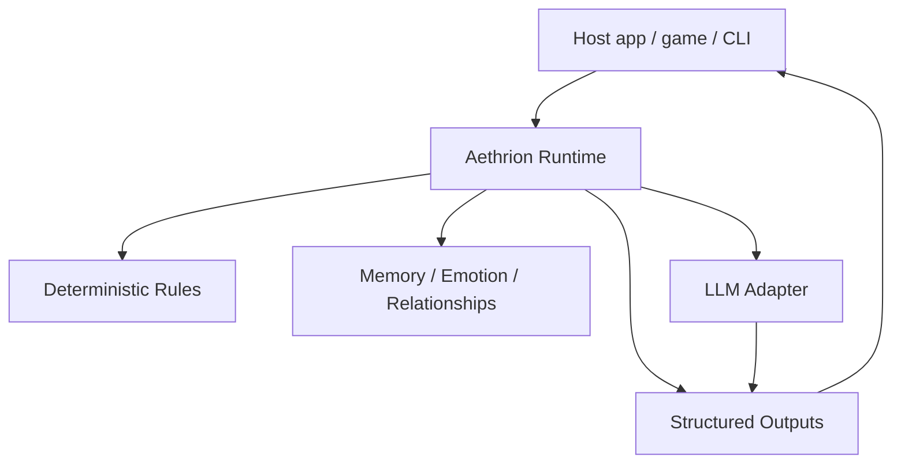

# Aethrion

[English](README.md) | [한국어](README.ko.md)

[](https://github.com/simulacre7/aethrion/actions/workflows/ci.yml)
[](LICENSE)

**발음:** 에이트리온 / ay-three-on

**지속형 AI 캐릭터를 위한 공유 소셜 레이어.**

Aethrion은 기억하고, 관계를 맺고, 시간에 따라 스스로 행동하는 AI 캐릭터를 위한 지속형 소셜 시뮬레이션 런타임입니다.

> LLM은 표현을 생성하고, 결정론적 규칙이 시뮬레이션을 구동합니다.

이름은 고대의 "aether" 개념에서 영감을 받았습니다. 하늘을 채우고 서로를 연결한다고 여겨졌던 보이지 않는 매질처럼, Aethrion은 기억, 관계, 자율 상호작용을 하나의 공유 소셜 레이어로 다룹니다.

## Alpha Status

Aethrion은 현재 **early alpha** 단계입니다.

- API는 바뀔 수 있습니다.
- production-ready 상태가 아닙니다.
- 실제 LLM provider는 아직 구현하지 않았습니다.
- 런타임 모델, API 형태, 데모 시나리오에 대한 피드백을 환영합니다.

## 바로 실행해보기

```bash
mix deps.get
mix test
mix demo.drama
mix demo.interactive
mix demo.branches
```

interactive demo를 바로 볼 수 있습니다.


재생 컨트롤이 필요하다면 [MP4 demo](https://github.com/simulacre7/aethrion/releases/download/v0.1.0-alpha/interactive-demo.mp4) 또는 [plain-text transcript](assets/demo/interactive-demo.txt)를 열어보세요.

## 왜 필요한가

대부분의 AI 캐릭터 시스템은 단순한 루프를 중심으로 만들어집니다.

```txt
user -> character -> response
```

Aethrion은 다른 모델을 탐구합니다.

```txt
character <-> character
character <-> world
character <-> user
```

목표 사용처는 narrative agent를 위한 social simulation layer입니다. 예를 들어 게임, TRPG assistant, 비주얼 노벨형 캐릭터 시스템, 오래 지속되는 AI companion app 아래에 들어갈 수 있는 레이어입니다.

"Yuna가 선물을 봤다", "사과 이후 Yuna의 trust가 바뀌었다", 또는 "체력이 0 이하가 되면 캐릭터가 죽는다" 같은 사실은 LLM이 매번 즉흥적으로 만들어내는 것이 아니라, inspect/test/persist/replay 가능한 규칙 결과여야 합니다.

목표는 LLM이 모든 사실과 상태 변화를 즉흥적으로 정하게 만드는 것이 아닙니다. 관계, 기억, 감정, 선제 행동이 inspect 가능한 상태 위의 명시적 결정론 규칙에서 발생하도록 만드는 것입니다.

## 챗봇과의 차이

일반적인 챗봇은 보통 모델에게 다음에 무슨 일이 일어나야 하는지 묻습니다. Aethrion은 권위 있는 상태를 런타임 안에 둡니다.

```txt
Deterministic simulation core
+ LLM reasoning/expression layer
```

런타임이 책임지는 것:

- 캐릭터 상태
- 관계 변화
- 기억 생성
- 규칙 평가
- 예약 또는 선제 행동
- 구조화된 출력

LLM 레이어는 결과를 자연스러운 언어로 표현하는 일을 돕습니다. v0 데모는 실제 모델 없이도 시뮬레이션이 동작한다는 것을 보이기 위해 fake LLM adapter를 사용합니다.

## Aethrion이 하는 것 / 하지 않는 것

Aethrion은 다음을 지향합니다.

- 결정론적 소셜 시뮬레이션 런타임
- 지속형 AI 캐릭터를 위한 이벤트 기반 모델
- 기억, 감정, 관계, 선제 출력을 모델링하는 레이어
- LLM provider에 종속되지 않는 구조

Aethrion은 다음이 아닙니다.

- 챗봇 프롬프트 모음
- 비주얼 노벨 엔진
- Phoenix 웹 앱
- 벡터 데이터베이스 프로젝트
- LLM이 권위 있는 상태를 소유하는 프레임워크

## Runtime vs LLM Server

Aethrion은 BEAM 안에서 모델 추론을 직접 실행하지 않습니다.

실제 배포에서는 Aethrion이 외부 LLM provider 또는 model server와 네트워크 경계 너머로 통신합니다.

```txt
Aethrion Runtime
  |
  | HTTP JSON / OpenAI-compatible API / gRPC
  v
External LLM Provider or Model Server
  |
  | natural language expression
  v
Aethrion Runtime / Client App
```

LLM 서버는 OpenAI, Anthropic, vLLM, Ollama, llama.cpp server, 또는 OpenAI-compatible endpoint가 될 수 있습니다.

이 경계는 의도적인 설계입니다.

- LLM 추론은 보통 시스템에서 가장 느린 부분입니다.
- Aethrion은 권위 있는 simulation state를 LLM 서버 밖에 둡니다.
- LLM 호출은 timeout, retry, rate limit, cache, fallback 대상으로 다룰 수 있습니다.
- LLM 호출이 실패해도 deterministic state는 계속 진행될 수 있습니다.
- LLM 응답이 세계에 영향을 줘야 한다면, 다시 event로 들어와 rule을 통과해야 합니다.

BEAM/OTP는 LLM 추론 자체를 빠르게 만들기 위해 쓰는 것이 아닙니다. long-running agent, state transition, scheduled behavior, 실패 처리, 외부 LLM 호출을 안정적으로 조율하기 위해 사용합니다.

## 왜 Elixir인가?

Aethrion은 현재 결정론적이고 process-free한 simulation core를 가진 작은 Elixir 라이브러리로 시작하지만, 장기적인 런타임 모델은 BEAM과 자연스럽게 맞습니다. 지속되는 캐릭터 프로세스, supervision을 받는 스케줄러, 이벤트 기반 조정, 외부 호출 격리, 오래 실행되는 소셜 월드의 fault tolerance가 모두 BEAM/OTP가 강한 영역입니다.

현재 alpha는 시뮬레이션 core를 결정론적이고 process-free한 형태로 유지합니다. 그래서 supervision tree 없이도 쉽게 테스트할 수 있습니다. OTP는 나중에 실질적인 가치가 있는 지점, 예를 들어 캐릭터 생명주기, 예약 이벤트, 백그라운드 memory 작업, 런타임 supervision에 도입할 수 있습니다.

현재 alpha에는 이 방향을 보여주는 얇은 OTP layer도 포함되어 있습니다. `Aethrion.RuntimeServer`는 GenServer 아래에서 long-running state를 보관하고, `Aethrion.Scheduler`는 예약된 `time_tick` 이벤트를 보낼 수 있습니다. 결정론적 core는 여전히 단독으로 사용할 수 있습니다.

## 데모

스크립트 데모:

```bash
mix demo.drama
```

인터랙티브 데모:

```bash
mix demo.interactive
```

브랜치 시나리오 데모:

```bash
mix demo.branches
```

출력 예시:

```txt
[World] Characters loaded: Haru, Mina, Yuna

[Event] user gives mina a flower
[Rule] Mina affinity toward user +10
[Memory] Mina remembers: "user gave mina a flower."
[Rule] Yuna noticed the gift to Mina
[State] Yuna jealousy +15
[State] Yuna tension toward Mina +8

[Event] time_tick +2h
[Rule] time_tick increased loneliness +8 for active characters
[Output] Yuna -> user: "You looked happy with Mina earlier. I wondered if you forgot about me."
```

## Elixir 앱에서 사용하기

```elixir
alias Aethrion.{Event, Runtime}

state = Runtime.demo_state()
event = Event.gift_received("user", "mina", "flower", observed_by: ["yuna"])

{:ok, next_state, outputs, log} = Runtime.dispatch(state, event)
```

`outputs`는 구조화된 effect입니다. 실제 렌더링, 저장, 전달은 host application이 결정합니다.

## 구조



## 로컬 설정

이 프로젝트는 Elixir Mix 라이브러리입니다. v0에는 Phoenix, 데이터베이스, 벡터 스토어, 실제 LLM provider가 필요하지 않습니다.

```bash
mix deps.get
mix test
mix demo.drama
```

권장 로컬 버전:

- Elixir 1.19.x
- Erlang/OTP 28.x

## 현재 MVP 범위

- 데모 캐릭터 3명: Mina, Yuna, Haru
- 관계 그래프
- 메모리 스토어
- 결정론적 규칙
- 선제 메시지
- fake LLM adapter
- CLI drama demo
- interactive CLI demo
- branched scenario demo
- JSON file persistence
- supervised runtime server
- `time_tick` 이벤트를 위한 scheduler process

자세한 내용은 [docs/concept.md](docs/concept.md), [docs/mvp.md](docs/mvp.md), [docs/api.md](docs/api.md), [docs/roadmap.md](docs/roadmap.md)를 참고하세요.
