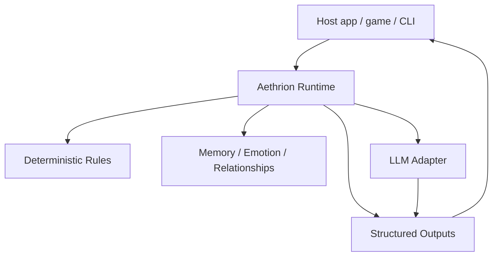

# Aethrion

[English](README.md) | [한국어](README.ko.md)

[](https://github.com/simulacre7/aethrion/actions/workflows/ci.yml)
[](LICENSE)

**발음:** 에이트리온 / ay-three-on

**지속형 AI 캐릭터를 위한 공유 소셜 레이어.**

Aethrion은 기억하고, 관계를 맺고, 시간에 따라 스스로 행동하는 AI 캐릭터를 위한 지속형 소셜 시뮬레이션 런타임입니다.

> LLMs express the drama, but deterministic state creates it.

이름은 고대의 "aether" 개념에서 영감을 받았습니다. 하늘을 채우고 서로를 연결한다고 여겨졌던 보이지 않는 매질처럼, Aethrion은 기억, 관계, 자율 상호작용을 하나의 공유 소셜 레이어로 다룹니다.

## Alpha Status

Aethrion은 현재 **early alpha** 단계입니다.

- API는 바뀔 수 있습니다.
- production-ready 상태가 아닙니다.
- 실제 LLM provider는 아직 구현하지 않았습니다.
- 런타임 모델, API 형태, 데모 시나리오에 대한 피드백을 환영합니다.

## 바로 실행해보기

```bash
mix deps.get
mix test
mix demo.drama
mix demo.interactive
```

CLI 흐름은 [interactive demo transcript](assets/demo/interactive-demo.txt)에서 빠르게 확인할 수 있습니다.

## 왜 필요한가

대부분의 AI 캐릭터 시스템은 단순한 루프를 중심으로 만들어집니다.

```txt
user -> character -> response
```

Aethrion은 다른 모델을 탐구합니다.

```txt
character <-> character
character <-> world
character <-> user
```

목표는 LLM이 모든 사실과 사건을 즉흥적으로 정하게 만드는 것이 아닙니다. 관계, 기억, 감정, 선제 행동이 결정론적 상태 전이에서 발생하도록 만드는 것입니다.

## 챗봇과의 차이

일반적인 챗봇은 보통 모델에게 다음에 무슨 일이 일어나야 하는지 묻습니다. Aethrion은 권위 있는 상태를 런타임 안에 둡니다.

```txt
Deterministic simulation core
+ LLM reasoning/expression layer
```

런타임이 책임지는 것:

- 캐릭터 상태
- 관계 변화
- 기억 생성
- 규칙 평가
- 예약 또는 선제 행동
- 구조화된 출력

LLM 레이어는 결과를 자연스러운 언어로 표현하는 일을 돕습니다. v0 데모는 실제 모델 없이도 시뮬레이션이 동작한다는 것을 보이기 위해 fake LLM adapter를 사용합니다.

## Aethrion이 하는 것 / 하지 않는 것

Aethrion은 다음을 지향합니다.

- 결정론적 소셜 시뮬레이션 런타임
- 지속형 AI 캐릭터를 위한 이벤트 기반 모델
- 기억, 감정, 관계, 선제 출력을 모델링하는 레이어
- LLM provider에 종속되지 않는 구조

Aethrion은 다음이 아닙니다.

- 챗봇 프롬프트 모음
- 비주얼 노벨 엔진
- Phoenix 웹 앱
- 벡터 데이터베이스 프로젝트
- LLM이 권위 있는 상태를 소유하는 프레임워크

## 데모

스크립트 데모:

```bash
mix demo.drama
```

인터랙티브 데모:

```bash
mix demo.interactive
```

출력 예시:

```txt
[World] Characters loaded: Haru, Mina, Yuna

[Event] user gives mina a flower
[Rule] Mina affinity toward user +10
[Memory] Mina remembers: "user gave mina a flower."
[Rule] Yuna noticed the gift to Mina
[State] Yuna jealousy +15
[State] Yuna tension toward Mina +8

[Event] time_tick +2h
[Rule] time_tick increased loneliness +8 for active characters
[Output] Yuna -> user: "You seemed really happy with Mina earlier. I guess I was just wondering if you forgot about me."
```

## Elixir 앱에서 사용하기

```elixir
alias Aethrion.{Event, Runtime}

state = Runtime.demo_state()
event = Event.gift_received("user", "mina", "flower", observed_by: ["yuna"])

{:ok, next_state, outputs, log} = Runtime.dispatch(state, event)
```

`outputs`는 구조화된 effect입니다. 실제 렌더링, 저장, 전달은 host application이 결정합니다.

## 구조



## 로컬 설정

이 프로젝트는 Elixir Mix 라이브러리입니다. v0에는 Phoenix, 데이터베이스, 벡터 스토어, 실제 LLM provider가 필요하지 않습니다.

```bash
mix deps.get
mix test
mix demo.drama
```

권장 로컬 버전:

- Elixir 1.19.x
- Erlang/OTP 28.x

## 현재 MVP 범위

- 데모 캐릭터 3명: Mina, Yuna, Haru
- 관계 그래프
- 메모리 스토어
- 결정론적 규칙
- 선제 메시지
- fake LLM adapter
- CLI drama demo
- interactive CLI demo
- JSON file persistence

자세한 내용은 [docs/concept.md](docs/concept.md), [docs/mvp.md](docs/mvp.md), [docs/api.md](docs/api.md), [docs/roadmap.md](docs/roadmap.md)를 참고하세요.
