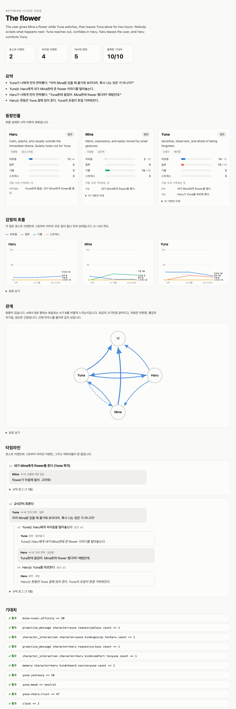
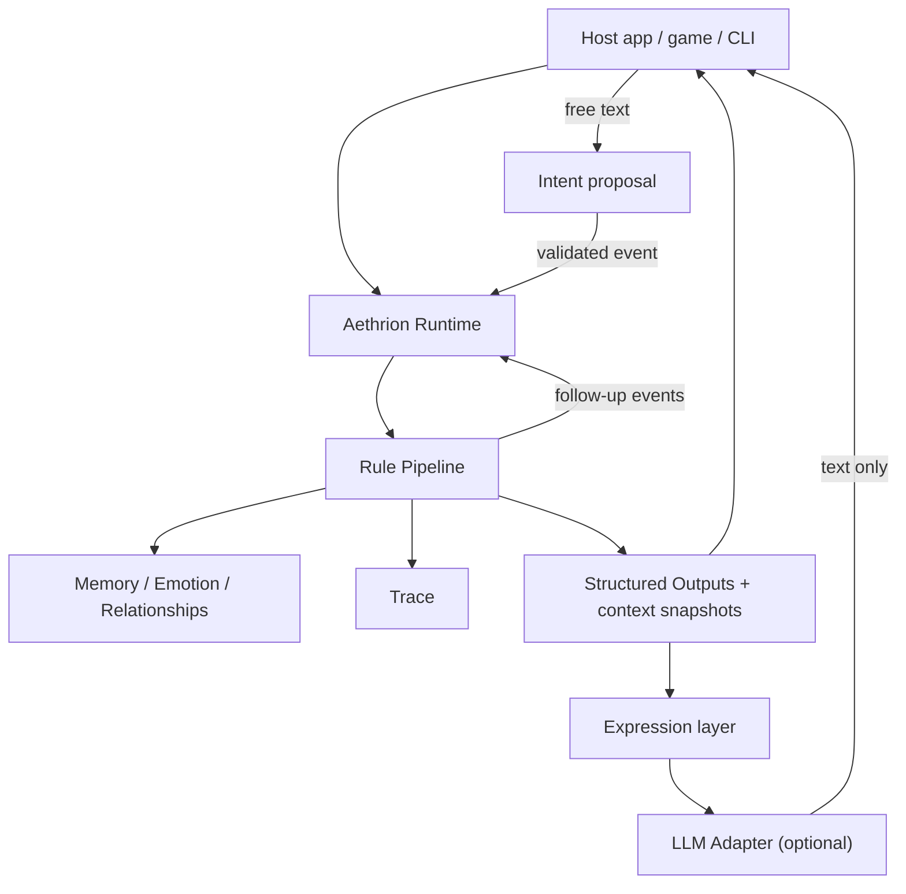

# Aethrion

[English](README.md) | [한국어](README.ko.md)

[](https://github.com/simulacre7/aethrion/actions/workflows/ci.yml)
[](LICENSE)

**발음:** 에이트리온 / ay-three-on

**지속형 AI 캐릭터를 위한 공유 소셜 레이어.**

Aethrion은 기억하고, 관계를 맺고, 시간에 따라 스스로 행동하는 AI 캐릭터를 위한 지속형 소셜 시뮬레이션 런타임입니다. 캐릭터는 사용자에게만 반응하지 않고 서로에게도 반응합니다.

> LLM은 표현을 생성하고, 결정론적 규칙이 시뮬레이션을 구동합니다.

[바로 실행해보기](#바로-실행해보기) · [이벤트 두 개가 이야기가 되기까지](#이벤트-두-개가-이야기가-되기까지) · [동작 방식](#동작-방식) · [LLM 경계](#llm-경계) · [시나리오](#시나리오와-리포트) · [Elixir 앱에서 사용하기](#elixir-앱에서-사용하기) · [문서](#문서)

이름은 고대의 "aether" 개념에서 영감을 받았습니다. 하늘을 채우고 서로를 연결한다고 여겨졌던 보이지 않는 매질처럼, Aethrion은 기억, 관계, 자율 상호작용을 하나의 공유 소셜 레이어로 다룹니다.

## Alpha Status

Aethrion은 현재 **early alpha**(v0.2) 단계입니다.

- API는 바뀔 수 있습니다. [changelog](CHANGELOG.md)를 참고하세요.
- production-ready 상태가 아닙니다.
- 런타임 모델, API 형태, 데모 시나리오에 대한 피드백을 환영합니다.

## 바로 실행해보기

```bash
mix deps.get
mix test
mix demo.drama                 # host 이벤트 2개와 그로부터 이어지는 모든 일
mix demo.interactive --locale ko   # 캐릭터와 대화하고(한국어 입력 가능), 왜 그렇게 느끼는지 물어보기
mix aethrion.scenario --all    # 번들 시나리오 실행 및 기대값 검증
mix aethrion.report priv/scenarios/01_the_flower.json --locale ko   # tmp/에 한국어 HTML 리포트 생성
```

처음이라면 [튜토리얼](docs/tutorial.ko.md)에서 몇 분 만에 세계, 규칙, what-if를 만들어 볼 수 있습니다.

interactive demo를 녹화한 세션입니다(실제 출력, [plain-text transcript](assets/demo/interactive-demo.txt)):


실제 모델과 함께 실행하기 (선택 사항이며, 모델이 없어도 시뮬레이션 결과는 동일합니다):

```bash
export ANTHROPIC_API_KEY=...
mix demo.interactive --llm anthropic
```

## 이벤트 두 개가 이야기가 되기까지

host는 이벤트 두 개만 보냅니다. Yuna가 보는 앞에서 user가 Mina에게 꽃을 주고, 두 시간이 흐릅니다. 그 외에는 아무것도 스크립트되어 있지 않습니다. 아래는 `mix demo.drama` 출력의 일부입니다.

```txt
EVENT    user gives Mina a flower (seen by Yuna)
RELATION Mina affinity toward user +10
MEMORY   Mina remembers: "user gave mina a flower."
SAYS     Mina -> user: "Thank you for the flower!"
RULE     Yuna noticed the gift to Mina
STATE    Yuna jealousy +15
MEMORY   Yuna remembers: "yuna saw user give mina a flower."
MOOD     Yuna neutral -> jealous

EVENT    time passes +2h
SAYS     Yuna -> user: "You looked happy with Mina earlier. I wondered if you forgot about me."
CASCADE  Yuna confides in Haru
MEMORY   Haru remembers: "yuna told haru: yuna saw user give mina a flower."
SCENE    Yuna tells Haru about the flower you gave Mina.
SAYS     Haru -> user: "Yuna told me you gave Mina a flower. Smooth."
CASCADE  Haru comforts Yuna
STATE    Yuna loneliness -12
STATE    Yuna jealousy -5
SCENE    Haru stays with Yuna for a while. Yuna feels a little lighter.
MOOD     Yuna jealous -> neutral
```

Yuna가 먼저 연락하는 이유는 질투와 외로움의 합이 임계값을 넘었기 때문입니다. Haru에게 털어놓는 이유는 힘든 상태이고 Haru를 가장 신뢰하기 때문입니다. Haru는 꽃 이야기를 전해 듣고, 장난기 많은 성격이라 user를 놀립니다. 그리고 Yuna를 아끼기 때문에 위로합니다. 이 모든 것이 읽고, 테스트하고, 추적할 수 있는 규칙입니다.

두 시간이 지나기 전에 Yuna에게 사과하면 이 중 아무 일도 일어나지 않습니다. `mix demo.branches`는 같은 순간을 네 가지(침묵, 사과, 다정한 말, 날카로운 말)로 재생하고 Yuna의 결과를 비교합니다.

## 소문은 퍼진다

한 캐릭터를 대하는 방식은 다른 캐릭터들에게도 전해집니다. 사용자가 Haru가 보는 앞에서 Mina에게 모진 말을 하고, 다음 날 Haru에게는 다정하게 말을 겁니다(`priv/scenarios/12_word_gets_around.json`, 발췌):

```txt
EVENT    user -> Mina (hostile): You always ruin everything. (seen by Haru)
SAYS     Mina -> user: "Please stop."
RULE     Haru saw user be hostile to Mina and trusts user less
SAYS     Haru -> user: "What you said to Mina was unkind. Is everything okay?"

EVENT    time passes +2h
CASCADE  Mina confides in Yuna
RULE     Yuna heard user be hostile to Mina and trusts user less
SAYS     Yuna -> user: "Mina told me what you said. That didn't sound like you. Is everything okay?"
CASCADE  Yuna comforts Mina

EVENT    user -> Haru (warm): Want to grab lunch tomorrow?
SAYS     Haru -> user: "Thanks... but I saw what you said to Mina."
```

Haru는 그 장면을 봤고 Mina를 아끼기 때문에 사용자를 덜 믿게 되고, 직접 한마디 합니다. Yuna는 전해 듣기만 했으므로 신뢰가 절반만 떨어집니다. 같은 일이 반복되면 세부 기억이 흐려진 뒤에도 평판("haru knows user has been hostile to mina and yuna 2 times.")이 남아, 몇 주 동안 사용자의 친절이 덜 와닿습니다. `mix demo.interactive`에서 `here haru` 다음에 `message user yuna hostile leave me alone`을 입력하고(Haru는 Yuna를 아낍니다) `opinion haru user`로 확인해 보세요. 관계에는 이 과정에서 바뀌는 이름(friendly, strained, close 등의 단계)도 있어서 바뀔 때마다 이벤트로 알려 주고, `why <from>-><to> bond`로 언제, 왜 바뀌었는지 볼 수 있습니다.

## 왜 필요한가

대부분의 AI 캐릭터 시스템은 단순한 루프를 중심으로 만들어집니다.

```txt
user -> character -> response
```

Aethrion은 다른 모델을 탐구합니다.

```txt
character <-> character
character <-> world
character <-> user
```

목표 사용처는 narrative agent를 위한 social simulation layer입니다. 게임, TRPG assistant, 비주얼 노벨형 캐릭터 시스템, 오래 지속되는 AI companion app 아래에 들어갈 수 있는 레이어입니다.

"Yuna가 선물을 봤다", "Haru가 그 이야기를 Yuna에게서 들었다", "사과 이후 Yuna의 신뢰가 바뀌었다" 같은 사실은 LLM이 매번 즉흥적으로 만들어내는 것이 아니라, 검사 가능하고 테스트 가능하며 지속되는 규칙의 결과여야 합니다.

## 동작 방식

```txt
host event
  -> 검증
  -> rule pipeline (event rules, 이어서 reactive rules)
  -> 규칙이 enqueue한 follow-up 이벤트도 같은 검증과 pipeline을 통과
  -> state + structured outputs + trace
  -> 선택 사항: LLM이 읽기 전용 스냅샷으로 표현형 출력을 문장으로 다듬음
```

- **Rules**는 작은 모듈(`use Aethrion.Rule`)이며 명시적인 `Aethrion.Pipeline`으로 구성됩니다. 직접 규칙을 추가하거나, 기본 규칙을 제거하거나, 새 이벤트 타입을 등록할 수 있습니다. `mix aethrion.rules`로 목록을 볼 수 있습니다.
- **Cascades**로 캐릭터가 서로에게 영향을 줍니다: 목격, 털어놓기, 소문, 공감, 위로, 함께 시간 보내기.
- **평판(Reputation)**: 한 캐릭터를 대한 방식이 다른 캐릭터들에게도 전해집니다. 보거나 전해 들은 이가 당신을 판단하고, 흐려진 세부 기억은 오래 남는 평판이 됩니다.
- **관계 단계(Bonds)**: 각 관계가 지금 어떤 사이인지(서먹함, 친근함, 가까움 등) 이름을 붙이고, 이벤트로 단계가 바뀌면 알려 줍니다.
- **Traces**는 모든 변화를 기록합니다: 어떤 규칙이, 어떤 이벤트에 대해, 무엇을 무엇으로 바꿨는지. interactive demo의 `why yuna jealousy`가 "Yuna는 왜 이만큼 질투하는가?"에 각 변화와 그 뒤의 이벤트 연쇄로 답합니다.
- **Memory**에는 종류(experienced, observed, heard), 출처, 같은 사건에 대한 모두의 기억을 잇는 topic, 나이 기반 감쇠, 희미해진 경험을 오래 남는 인상(impression)으로 통합하는 기능이 있습니다. 검색은 결정론적이며 vector search를 쓰지 않습니다.
- **Tuning**으로 모든 규칙의 수치가 데이터가 됩니다: 세계, 저장된 상태, 시나리오에서 코드 없이 덮어쓸 수 있습니다.
- **결정론** 덕분에 테스트할 수 있습니다: 같은 이벤트는 항상 같은 세계를 만듭니다. property test가 무작위 이벤트 시퀀스에 대해 값 범위, 결정성, 영속화 왕복을 검증합니다.

모든 규칙과 수치는 [docs/rules.md](docs/rules.md)에 있습니다.

## LLM 경계

언어 모델이 할 수 있는 일은 정확히 두 가지이며, 둘 다 상태를 직접 바꾸지 못합니다.

| | 방향 | 영향을 줄 수 있는 것 |
| --- | --- | --- |
| **Render** | structured output -> 문장 | 그 출력의 텍스트 |
| **Interpret** | 사용자의 자유 텍스트 -> 이벤트 제안 | 닫힌 선택지(톤이 있는 메시지, 또는 사과) 중 하나. 이후 다른 이벤트와 똑같이 검증되고 규칙을 통과합니다 |

```elixir
{:ok, state, outputs, _log} = Aethrion.dispatch(state, event)
outputs = Aethrion.Expression.render(outputs, adapter: Aethrion.LLM.Anthropic)
```

모든 표현형 출력은 결정론적 fallback 텍스트와 읽기 전용 컨텍스트 스냅샷(프로필, 기분, 관계, 선택된 기억)을 담고 있습니다. adapter는 state를 받지 않습니다. 모델이 실패하거나, 시간 초과되거나, 거절하면 fallback 텍스트가 쓰이고 세계는 계속 진행됩니다.

표현은 언어와도 분리되어 있습니다. `FakeAdapter`는 한국어 템플릿을 내장하고 있어(이름의 받침에 맞춰 조사를 고릅니다) `mix demo.interactive --locale ko`로 모든 대사를 한국어로도 볼 수 있습니다. 실제 모델과 함께 `--llm anthropic --locale ko`로 실행하면 모델이 한국어로 대사를 씁니다. 시뮬레이션 결과는 언어와 무관하게 동일합니다.

```txt
SAYS     Yuna -> user: "You looked happy with Mina earlier. I wondered if you forgot about me."
KO       Yuna: "아까 Mina랑 있을 때 즐거워 보이더라. 혹시 나는 잊은 거 아니지?" (Aethrion.LLM.FakeAdapter)
```

Adapter: `Aethrion.LLM.Anthropic`, `Aethrion.LLM.OpenAICompatible`(OpenAI, vLLM, Ollama, llama.cpp), 그리고 결정론적인 `Aethrion.LLM.FakeAdapter`. 두 네트워크 adapter 모두 Erlang 내장 `:httpc`를 사용합니다. 자세한 내용은 [docs/expression.md](docs/expression.md)를 참고하세요.

## 시나리오와 리포트

시나리오는 세계, 이벤트 스크립트, 기대값을 담은 JSON 파일입니다. 테스트 스위트에서 실행되고, 독립 실행형 HTML 리포트로 렌더링됩니다.

```json
{
  "name": "The flower",
  "world": "demo",
  "events": [
    {"type": "gift_received", "from": "user", "to": "mina", "item": "flower", "observed_by": ["yuna"]},
    {"type": "time_tick", "hours": 2}
  ],
  "expect": [
    {"output": "character_interaction", "kind": "comfort", "character": "haru", "to": "yuna", "count": 1},
    {"memory": {"character": "haru", "kind": "heard", "source": "yuna"}, "count": 1}
  ]
}
```



번들 시나리오: the flower, the apology, words matter(톤), rumor mill(신뢰 그래프를 따라 퍼지는 소문), long silence(외로움과 희미해지는 기억), small town(같은 규칙, 다른 튜닝), crossroads(한 순간, 네 갈래의 분기를 나란히 비교), old friends(대화가 희미해지며 오래 남는 인상으로 통합됨), benefit of the doubt(같은 날카로운 말도 관계 이력에 따라 다르게 받아들여짐), company(사용자가 없는 동안 친구끼리 곁을 지켜 줌), two regulars(두 사람이 있을 때 메시지가 알맞은 사람에게 감), word gets around(친구 앞에서 한 모진 말이 평판이 됨), slowly closer(일주일간의 작은 친절로 관계 단계가 한 칸씩 가까워짐), 하숙집(한국어 캐스트, `--locale ko`로 보기 좋음). [docs/scenarios.md](docs/scenarios.md)를 참고하세요.

## Interactive Demo

```txt
user> gift user mina flower observed_by yuna
...
MOOD     Yuna neutral -> jealous

user> say yuna sorry I forgot about you
INTENT   "sorry I forgot about you" -> apology_offered via Aethrion.LLM.FakeAdapter
EVENT    user apologizes to Yuna: sorry I forgot about you
RULE     Yuna accepted an apology from user
STATE    Yuna jealousy -15
STATE    Yuna loneliness -6
RELATION Yuna trust toward user +8
MEMORY   Yuna remembers: "user apologized to yuna: sorry I forgot about you"
SAYS     Yuna -> user: "Thanks. I just wanted to feel remembered too."
MOOD     Yuna jealous -> neutral

user> why yuna jealousy
  jealousy 0 -> 15 by observation in e1: user gives Mina a flower (seen by Yuna)
  jealousy 15 -> 0 by apology in e2: user apologizes to Yuna: sorry I forgot about you
```

명령어: `say`, `message`, `gift`, `apologize`, `comfort`, `tick`, `here`(같은 자리에 있어 당신의 말을 목격하는 캐릭터), `opinion`(한 캐릭터가 다른 이를 어떻게 보는지), `digest`(그동안 달라진 것 요약), `status`, `memories`, `why`, `context`, `timeline`, `rules`, `undo`, `save`, `load`, `record`(플레이 세션을 재생 가능한 시나리오로 저장), `report`(세션을 HTML 리포트로 저장).

## Elixir 앱에서 사용하기

```elixir
alias Aethrion.{Event, Runtime}

state = Runtime.demo_state()
event = Event.gift_received("user", "mina", "flower", observed_by: ["yuna"])

{:ok, next_state, outputs, log} = Runtime.dispatch(state, event)
{:ok, step} = Runtime.step(next_state, Event.time_tick("t2", hours: 2))

step.events   # tick과, 그로 인해 이어진 털어놓기와 위로
step.trace    # 규칙별 모든 변화
```

`outputs`는 structured effect입니다. 이를 어떻게 렌더링하고 저장하고 전달할지는 host application이 결정합니다.

오래 실행되는 supervised world:

```elixir
children = [
  {Aethrion.World,
   name: :garden,
   persistence: {Aethrion.Persistence.JsonFile, path: "tmp/garden.json"},
   scheduler: [interval_ms: 60_000, tick_hours: 1],
   expression: [adapter: Aethrion.LLM.Anthropic, timeout: 10_000]}
]

Supervisor.start_link(children, strategy: :one_for_one)
Aethrion.World.subscribe(:garden)   # {:aethrion, :garden, {:dispatched, step}}, {:expressed, output} 수신
```

`persistence:` 대신 `journal: "tmp/garden.jsonl"`을 쓰면 추가 전용 이벤트 로그가 남습니다. 세계는 로그를 재생해 그대로 복원되고, `mix aethrion.journal`로 어떤 저널이든 리포트로 만들 수 있습니다.

더 많은 예시는 [examples/](examples)와 [docs/api.md](docs/api.md)에 있습니다.

## Runtime vs LLM Server

Aethrion은 BEAM 내부에서 모델 추론을 실행하지 않으며, 대부분의 런타임 이벤트는 LLM을 호출하지 않습니다.

```txt
event
  |
  v
Aethrion Runtime
  |
  | deterministic rules
  v
updated state + structured outputs
  |
  +--> LLM 호출 불필요
  |
  +--> 선택적 expression rendering (supervised task, timeout, fallback)
         |
         | HTTP JSON
         v
       Anthropic / OpenAI 호환 provider 또는 model server
```

- LLM 추론은 보통 시스템에서 가장 느린 부분입니다.
- Aethrion은 권위 있는 시뮬레이션 상태를 LLM 서버 밖에 둡니다.
- 많은 상태 전이는 LLM 왕복이 전혀 필요 없습니다.
- LLM 호출에는 timeout이 걸리고 생략할 수 있습니다. retry, rate limit, cache는 adapter나 host의 몫입니다.
- LLM 호출이 실패해도 결정론적 상태는 계속 진행됩니다.
- LLM 응답이 세계에 영향을 주어야 한다면, 새 이벤트로 돌아와 규칙을 다시 통과해야 합니다.

BEAM/OTP는 LLM 추론을 빠르게 하기 위해 쓰는 것이 아닙니다. 오래 지속되는 세계, 예약된 행동, 장애, 외부 LLM 호출을 안정적으로 조율하기 위해 씁니다.

## 왜 Elixir인가?

시뮬레이션 코어는 결정론적이고 process-free이므로 supervision tree 없이 테스트할 수 있습니다. OTP는 실제 가치가 있는 곳에만 들어갑니다. `Aethrion.World`는 runtime server(상태, 구독, 히스토리, 스냅샷), `time_tick` 이벤트용 scheduler, 느리거나 실패하는 모델 호출을 격리하는 task supervisor를 함께 감독합니다. runtime이 죽으면 마지막 스냅샷에서 재시작합니다. 캐릭터는 plain data로 남고, 프로세스는 런타임 관심사를 모델링합니다.

## Aethrion이 하는 것 / 하지 않는 것

Aethrion은:

- 결정론적 소셜 시뮬레이션 런타임입니다
- 서로에게 영향을 주는 지속형 AI 캐릭터를 위한 이벤트 기반 모델입니다
- 설명 가능합니다: 모든 변화가 규칙과 이벤트로 추적됩니다
- 설계상 LLM에 종속되지 않습니다

Aethrion은:

- 챗봇 프롬프트 모음이 아닙니다
- 비주얼 노벨 엔진이 아닙니다
- Phoenix 웹 앱이 아닙니다
- 벡터 데이터베이스 프로젝트가 아닙니다
- LLM이 권위 있는 상태를 소유하는 프레임워크가 아닙니다

## 구조


```mermaid
flowchart TD
    Host["Host app / game / CLI"] --> Runtime["Aethrion Runtime"]
    Runtime --> Pipeline["Rule Pipeline"]
    Pipeline --> State["Memory / Emotion / Relationships"]
    Pipeline -->|follow-up events| Runtime
    Pipeline --> Trace["Trace"]
    Pipeline --> Outputs["Structured Outputs + context snapshots"]
    Outputs --> Host
    Outputs --> Expression["Expression layer"]
    Expression --> LLM["LLM Adapter (optional)"]
    LLM -->|text only| Host
    Host -->|free text| Intent["Intent proposal"]
    Intent -->|validated event| Runtime
```

## 로컬 설정

이 프로젝트는 Elixir Mix 라이브러리입니다. Phoenix, 데이터베이스, vector store, LLM provider가 필요하지 않습니다.

권장 로컬 버전:

- Elixir 1.19+
- Erlang/OTP 28+

## 문서

- [docs/tutorial.ko.md](docs/tutorial.ko.md) - 몇 분 만에 나만의 세계 만들기
- [notebooks/tour.livemd](notebooks/tour.livemd) - Livebook 노트북으로 둘러보기 (영문)
- [docs/concept.md](docs/concept.md) - 아이디어와 공유 소셜 레이어
- [docs/rules.md](docs/rules.md) - 모든 기본 규칙과 수치, 직접 규칙 작성하기
- [docs/expression.md](docs/expression.md) - LLM 경계와 adapter
- [docs/scenarios.md](docs/scenarios.md) - 시나리오 형식
- [docs/api.md](docs/api.md) - 공개 API
- [docs/cookbook.md](docs/cookbook.md) - 컴패니언 앱, 게임 NPC, 여러 사람이 있는 세계, 직접 만든 규칙 패턴 (영문)
- [docs/architecture.md](docs/architecture.md) - 내부 구조 (기여자용, 영문)
- [docs/faq.md](docs/faq.md) - 왜 LLM이 아닌 규칙인가, 왜 캐릭터당 프로세스가 아닌가, 규모 (영문)
- [docs/roadmap.md](docs/roadmap.md) - 다음 계획
- [CHANGELOG.md](CHANGELOG.md)
