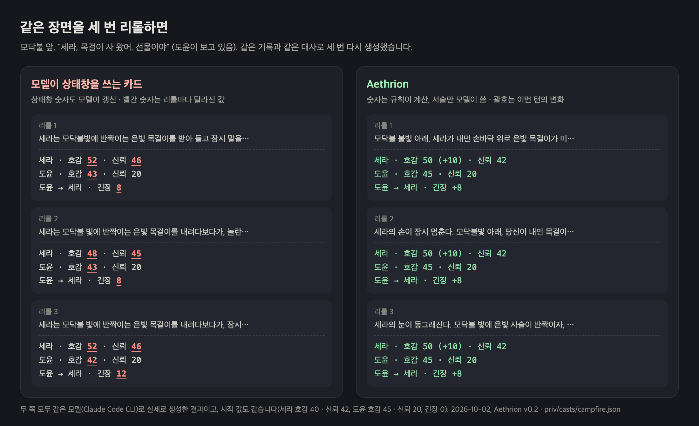
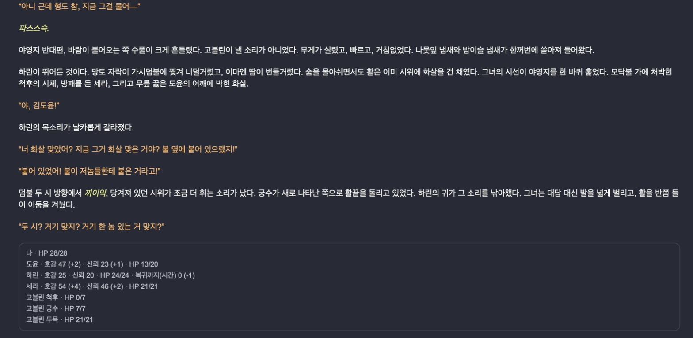

# Aethrion

[English](README.md) | [한국어](README.ko.md)

[](https://github.com/simulacre7/aethrion/actions/workflows/ci.yml)
[](LICENSE)

**숫자는 규칙이 지키고, 이야기는 모델이 합니다.**

Aethrion은 AI 롤플레이에서 흔들리면 안 되는 것들을 모델 대신 규칙으로 계산합니다. 호감도와 신뢰, HP와 주사위, 누가 무엇을 봤고 누가 누구에게 말했는지, 지금 어느 엔딩으로 가고 있는지 같은 것들입니다. 모델은 계산된 결과를 받아서 이야기만 씁니다. RisuAI나 SillyTavern에 Custom API로 연결해서 쓰고, 직접 만드는 채팅 앱이나 게임에도 붙일 수 있습니다.

<sub>발음: 에이트리온. 개인 프로젝트이며 RisuAI·SillyTavern 공식 프로젝트와는 관계없습니다. MIT 라이선스, 초기 알파.</sub>

## 이런 적 있으시죠

롤플레이·시뮬 채팅에서 상태 관리는 보통 모델이 맡습니다. 카드가 응답마다 상태창을 출력하고 그 숫자를 기억하라고 시키는 식입니다. 채팅이 길어지면 이런 일이 생깁니다.

- **리롤하면 두 번 적용됩니다.** 공격을 다시 굴리면 데미지가 또 들어가고, 칭찬을 다시 굴리면 호감도가 또 오릅니다.
- **숫자가 흐트러집니다.** 50턴쯤 지나면 HP가 슬그머니 회복돼 있고, 쌓아 둔 신뢰는 사라져 있습니다.
- **보지도 않은 걸 압니다.** 단둘이 있을 때 준 선물을 다른 캐릭터가 알고 있습니다.
- **판정이 모델 기분을 따라갑니다.** 같은 공격이 한 번은 맞고 한 번은 빗나갑니다.

## Aethrion이 하는 일

플레이어가 쓴 문장을 Aethrion이 읽어서 규칙대로 적용하고, 그 결과를 모델에게 정해진 사실로 넘깁니다. 같은 채팅이면 언제나 같은 상태가 나오기 때문에 이렇게 됩니다.

- 리롤하면 문장만 바뀌고 판정은 그대로입니다.
- 앞의 문장을 고치면 그 지점부터 다시 계산됩니다.
- 캐릭터는 자기가 보거나 들은 것만 알고, 믿는 사람에게 그 이야기를 전합니다.
- 상태창에 이번 턴에 바뀐 만큼이 같이 나옵니다(`세라 · 호감 50 (+10)`). 어떤 규칙이 어떤 일 때문에 바꿨는지도 따라가 볼 수 있습니다.



<sub>같은 모델(Claude Code CLI)과 같은 시작 값으로 실제 생성한 결과입니다. 원본 데이터: [assets/demo/reroll.json](assets/demo/reroll.json)</sub>

아래는 함께 들어 있는 캐스트 '모닥불'을 Claude Code CLI를 내레이터로 두고 플레이한 기록입니다. 서술은 모델이 썼고, 숫자와 누가 무엇을 했는지는 규칙이 정했습니다.

```txt
나:   세라, 목걸이 사 왔어. 선물이야
      …그 모습을 지켜보던 도윤은 "와, 형, 나는 육포 한 조각도 안 사 왔으면서~" 하고 낄낄 웃었지만,
      세라 쪽으로 향한 눈길은 어딘가 비뚜름했다. …
      세라 · 호감 50 · 신뢰 42   도윤 → 하린 · 호감 +3 · 신뢰 +7   도윤 → 세라 · 긴장 +8
나:   고블린 척후를 벤다
      …세라는 새벽의 신께 짧게 기도하며 네 옆구리의 상처에 다시 빛을 얹고는 곧바로 네 앞을 막아섰고, …
```

목걸이를 건네는 걸 본 도윤은 샘이 나서, 정찰 나가 있는 하린에게 그 얘기를 전합니다. 세라는 선물 덕분에 호감이 기준선을 넘었고, 그래서 전투에서 고블린의 공격을 대신 맞아 줍니다. 선물 없이 싸우면 세라는 끝까지 나서지 않습니다.

RisuAI 데스크톱 앱에서 실제로 플레이한 화면입니다. 서술은 써지는 대로 스트리밍되고, 끝에 상태창이 붙습니다.



## 누구를 위한 건가요

| 이런 분이라면 | 여기서 시작하세요 |
| --- | --- |
| RisuAI·SillyTavern 유저, 카드 제작자 | [Custom API로 연결하기](docs/risuai.ko.md). 상태창이 같이 오고, 쓰던 캐릭터 카드도 가져와서 수치와 엔딩을 붙일 수 있습니다 |
| 캐릭터 채팅 앱이나 게임을 만드는 개발자 | [HTTP 서버로 띄우기](docs/embedding.ko.md#채팅-앱과-게임에서-쓰기). 사용자마다 세계 하나씩, 어떤 언어에서든 쓸 수 있습니다 |
| Elixir 개발자 | [런타임을 앱에 넣고](docs/embedding.ko.md#elixir-앱에서-사용하기) 규칙을 직접 작성하기 |

## 빠르게 시작하기

**Docker로 (Elixir 설치 불필요).** RisuAI 데스크톱 앱이나 SillyTavern에 연결됩니다(RisuAI 웹 버전은 내 컴퓨터의 서버에 닿지 못합니다).

```bash
git clone https://github.com/simulacre7/aethrion && cd aethrion
cp .env.example .env     # 접속 비밀번호, 그리고 모델: OpenRouter, Claude API, Ollama 등
docker compose up -d
```

그다음 http://localhost:4848 을 열고 **RisuAI** 버튼을 누르면 연결에 필요한 값과 캐릭터 카드가 나옵니다. RisuAI의 Custom API를 `http://localhost:4848/v1`로 두고, Key 칸에 접속 비밀번호를 넣으면 됩니다([자세한 순서](docs/risuai.ko.md#가장-쉬운-방법-docker)). 검증한 환경은 macOS의 RisuAI 데스크톱 2026.8.250과 SillyTavern 1.19.0입니다.

**Elixir로** (Elixir 1.19 이상, Erlang/OTP 28 이상. macOS는 `brew install elixir`). 데이터베이스는 필요 없습니다.

```bash
mix deps.get
mix demo.drama      # 이벤트 두 개를 넣으면 작은 인간관계 드라마가 나옵니다. 모델 불필요
mix aethrion.serve --cast priv/casts/campfire.json --locale ko --llm claude
```

그다음 http://localhost:4848 에서 대화하거나, http://localhost:4848/editor 에서 캐스트를 편집합니다. RisuAI에서 플레이하려면 `http://localhost:4848/v1`을 연결하세요([설정 방법](docs/risuai.ko.md)).

`--llm`으로 내레이터를 고릅니다.

- `claude`, `codex`: 이 컴퓨터에 로그인된 CLI. 키가 필요 없습니다.
- `ollama`, `lmstudio`, `llamacpp`: 로컬 모델
- `anthropic`: Claude API
- `openai --base-url ...`: OpenAI 호환 API

`--llm` 없이 띄우면 모델 대신 키워드 규칙과 정해진 문장이 쓰입니다. 테스트와 개발용이라 실제 플레이 느낌과는 다릅니다.

## 이런 걸 만들 수 있습니다

- **서로 영향을 주는 캐릭터들.** 선물 하나에 다른 캐릭터가 질투하고, 털어놓은 이야기가 소문으로 퍼지고, 플레이어가 없는 동안 친구끼리 위로합니다. ([둘러보기](docs/tour.ko.md))
- **평판과 관계 단계.** 한 캐릭터를 대한 방식이 다른 캐릭터에게도 전해집니다. 관계에는 서먹함, 친함, 가까움 같은 이름이 붙고, 그 이름이 바뀌어 갑니다. ([둘러보기](docs/tour.ko.md#소문은-퍼진다))
- **수치로 정해지는 엔딩.** 육성 시뮬의 스탯과 활동, 어느 엔딩에 무엇이 모자란지 알려 주는 힌트, 메신저형 인연 스토리를 만들 수 있습니다. ([스토리](docs/stories.ko.md))
- **전투.** HP, 방어, 치유, D&D 5e SRD의 d20 규칙을 씁니다. 동료는 플레이어를 믿을 때만 함께 싸웁니다. ([스토리](docs/stories.ko.md#엔딩과-전투))
- **캐스트 편집기와 루트 시뮬레이터.** `/editor`에서 플레이어가 칠 법한 대사로 루트를 적으면, 그 루트가 어느 엔딩에 닿는지 보여 줍니다. ([스토리](docs/stories.ko.md#세계-만들기))
- **함께 들어 있는 한국어 캐스트.**
  - `summer`: 육성 시뮬
  - `quest`: 늑대왕 토벌
  - `den`: D&D 늑대 굴
  - `academy`: 메신저 아카데미
  - `campfire`: 모닥불 파티 (영어판 `campfire_en`)

## 동작 방식

```txt
플레이어의 문장 -> 이벤트로 읽기 -> 규칙 -> 새 상태 + 모든 변화의 기록
                                              |
                                 모델은 결과를 이야기로 씀 (텍스트만)
```

모델이 하는 일은 두 가지이고, 어느 쪽도 상태를 직접 바꾸지 못합니다. 첫째, 플레이어의 문장이 무슨 행동인지 읽습니다. 정해진 선택지 안에서만 고르게 하고, 고른 결과는 규칙이 한 번 더 검사합니다. 둘째, 계산된 결과를 문장으로 씁니다. 모델이 답하지 못하거나 시간이 넘으면 미리 정해 둔 문장이 대신 나가고, 상태는 그대로 진행됩니다. 자세한 내용은 [LLM 경계](docs/embedding.ko.md#llm-경계)에 있습니다.

## 현재 상태

Aethrion은 아직 **초기 알파**(v0.2)입니다. 기능과 형식이 바뀔 수 있습니다([변경 기록](CHANGELOG.md)). 버그나 써 보신 소감은 [이슈](https://github.com/simulacre7/aethrion/issues)로 남겨 주세요. 긴 롤플레이를 하시는 분들이 어떤 캐스트로, 어떤 모델로 써 보셨는지 특히 궁금합니다.

## 문서

- [docs/risuai.ko.md](docs/risuai.ko.md): RisuAI·SillyTavern에서 Aethrion을 모델로 쓰기
- [docs/tour.ko.md](docs/tour.ko.md): 실제 출력으로 보는 시뮬레이션 (연쇄, 평판, 시나리오, interactive demo)
- [docs/stories.ko.md](docs/stories.ko.md): 엔딩, 전투, 인연 스토리, 캐스트 편집기, 채팅 문장 읽기
- [docs/embedding.ko.md](docs/embedding.ko.md): Elixir 앱에서 쓰기, HTTP API, LLM 경계, 구조
- [docs/tutorial.ko.md](docs/tutorial.ko.md): 몇 분 만에 나만의 세계 만들기
- [notebooks/tour.livemd](notebooks/tour.livemd): Livebook 노트북으로 둘러보기 (영문)
- [docs/concept.md](docs/concept.md): 아이디어와 공유 소셜 레이어 (영문)
- [docs/rules.md](docs/rules.md): 모든 기본 규칙과 수치, 직접 규칙 작성하기 (영문)
- [docs/expression.md](docs/expression.md): LLM 경계와 adapter (영문)
- [docs/scenarios.md](docs/scenarios.md): 시나리오 형식 (영문)
- [docs/api.md](docs/api.md): 공개 API (영문)
- [docs/cookbook.md](docs/cookbook.md): 컴패니언 앱, 게임 NPC, 여러 사람이 있는 세계, 직접 만든 규칙 패턴 (영문)
- [docs/architecture.md](docs/architecture.md): 내부 구조, 기여자용 (영문)
- [docs/faq.md](docs/faq.md): 왜 LLM이 아닌 규칙인가, 왜 캐릭터당 프로세스가 아닌가, 규모 (영문)
- [docs/roadmap.md](docs/roadmap.md): 다음 계획 (영문)
- [CHANGELOG.md](CHANGELOG.md)
