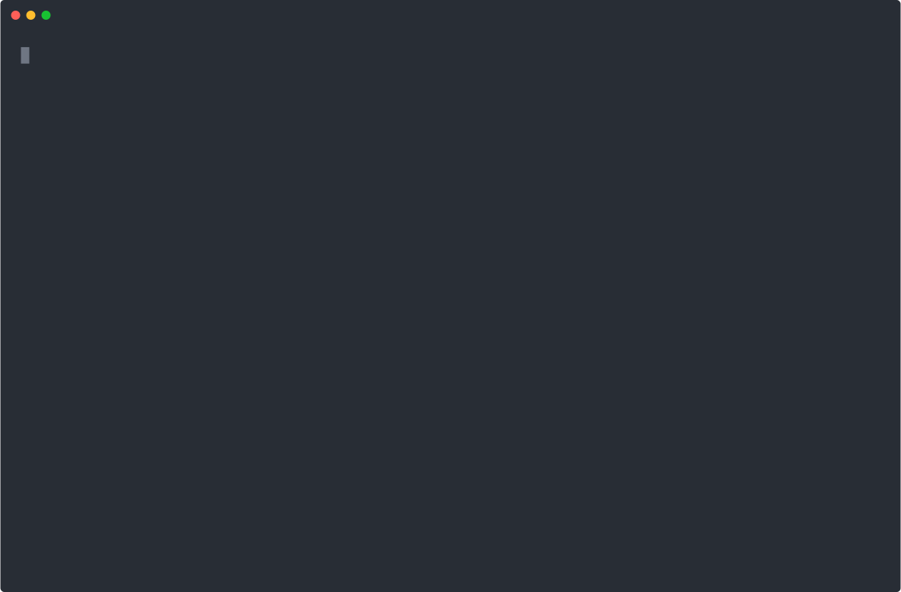
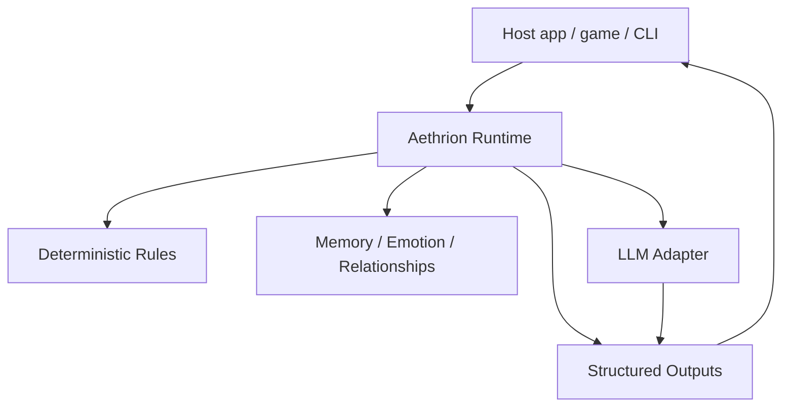

# Aethrion

[English](README.md) | [한국어](README.ko.md)

[](https://github.com/simulacre7/aethrion/actions/workflows/ci.yml)
[](LICENSE)

**Pronunciation:** 에이트리온 / ay-three-on

**A shared social layer for persistent AI characters.**

Aethrion is a persistent social simulation runtime for AI characters that remember, relate, and act over time.

> LLMs express the drama, but deterministic state creates it.

Inspired by the ancient idea of aether, Aethrion treats memory, relationships, and autonomous interaction as a shared social layer where persistent agents can live, change, and respond to each other.

## Alpha Status

Aethrion is currently **early alpha**.

- API may change.
- Not production-ready.
- Real LLM providers are not implemented yet.
- Feedback on the runtime model, API shape, and demo scenarios is welcome.

## Try It

```bash
mix deps.get
mix test
mix demo.drama
mix demo.interactive
```

See the [interactive demo transcript](assets/demo/interactive-demo.txt) for a quick look at the CLI flow.



## Why This Exists

Most AI character systems are built around a simple loop:

```txt
user -> character -> response
```

Aethrion explores a different model:

```txt
character <-> character
character <-> world
character <-> user
```

The goal is not to make an LLM improvise every fact. The goal is to make relationships, memories, emotions, and proactive behavior emerge from deterministic state transitions.

## How It Differs From A Chatbot

A normal chatbot usually asks the model what should happen next. Aethrion keeps authoritative state in the runtime.

```txt
Deterministic simulation core
+ LLM reasoning/expression layer
```

The runtime owns:

- character state
- relationship changes
- memory creation
- rule evaluation
- scheduled or proactive behavior
- structured outputs

The LLM layer only helps express the result in natural language. The v0 demo uses a fake LLM adapter to prove the simulation works without a real model.

## What Aethrion Is / Is Not

Aethrion is:

- a deterministic social simulation runtime
- an event-driven model for persistent AI characters
- a place to model memory, emotion, relationships, and proactive outputs
- LLM-agnostic by design

Aethrion is not:

- a chatbot prompt collection
- a visual novel engine
- a Phoenix web app
- a vector database project
- a framework where the LLM owns authoritative state

## Why Elixir?

Aethrion starts as a small Elixir library with a deterministic, process-free simulation core, but the long-term runtime model maps naturally to the BEAM: persistent character processes, supervised schedulers, event-driven coordination, and fault-tolerant long-running social worlds.

The current alpha keeps the simulation core deterministic and process-free so it can be tested without a running supervision tree. OTP can enter later where it has practical value: character lifecycles, scheduled events, background memory work, and runtime supervision.

The alpha now includes a thin OTP layer for that path: `Aethrion.RuntimeServer` stores long-running state under a GenServer, and `Aethrion.Scheduler` can emit scheduled `time_tick` events into it. The deterministic core remains usable on its own.

## Demo

Run the scripted demo:

```bash
mix demo.drama
```

Run the interactive demo:

```bash
mix demo.interactive
```

Example transcript:

```txt
[World] Characters loaded: Haru, Mina, Yuna

[Event] user gives mina a flower
[Rule] Mina affinity toward user +10
[Memory] Mina remembers: "user gave mina a flower."
[Rule] Yuna noticed the gift to Mina
[State] Yuna jealousy +15
[State] Yuna tension toward Mina +8

[Event] time_tick +2h
[Rule] time_tick increased loneliness +8 for active characters
[Output] Yuna -> user: "You looked happy with Mina earlier. I wondered if you forgot about me."
```

## Embedding Aethrion

```elixir
alias Aethrion.{Event, Runtime}

state = Runtime.demo_state()
event = Event.gift_received("user", "mina", "flower", observed_by: ["yuna"])

{:ok, next_state, outputs, log} = Runtime.dispatch(state, event)
```

`outputs` are structured effects. The host application decides how to render, store, or deliver them.

## Architecture



## Local Setup

This project is an Elixir Mix library. No Phoenix, database, vector store, or real LLM provider is required for v0.

```bash
mix deps.get
mix test
mix demo.drama
```

Recommended local versions:

- Elixir 1.19.x
- Erlang/OTP 28.x

## Current MVP Scope

- 3 demo characters: Mina, Yuna, Haru
- relationship graph
- memory store
- deterministic rules
- proactive messaging
- fake LLM adapter
- CLI drama demo
- interactive CLI demo
- JSON file persistence
- supervised runtime server
- scheduler process for `time_tick` events

See [docs/concept.md](docs/concept.md), [docs/mvp.md](docs/mvp.md), [docs/api.md](docs/api.md), and [docs/roadmap.md](docs/roadmap.md) for more detail.
