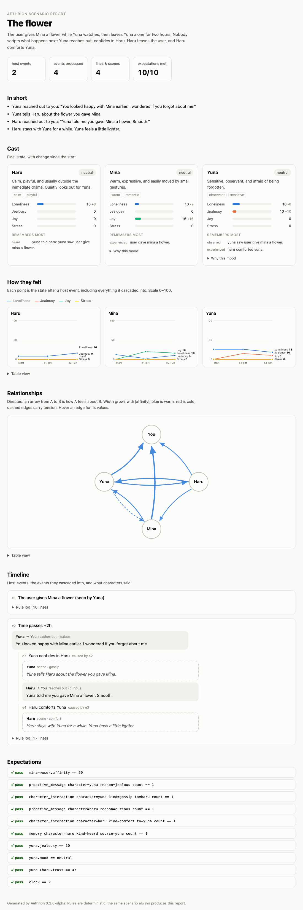
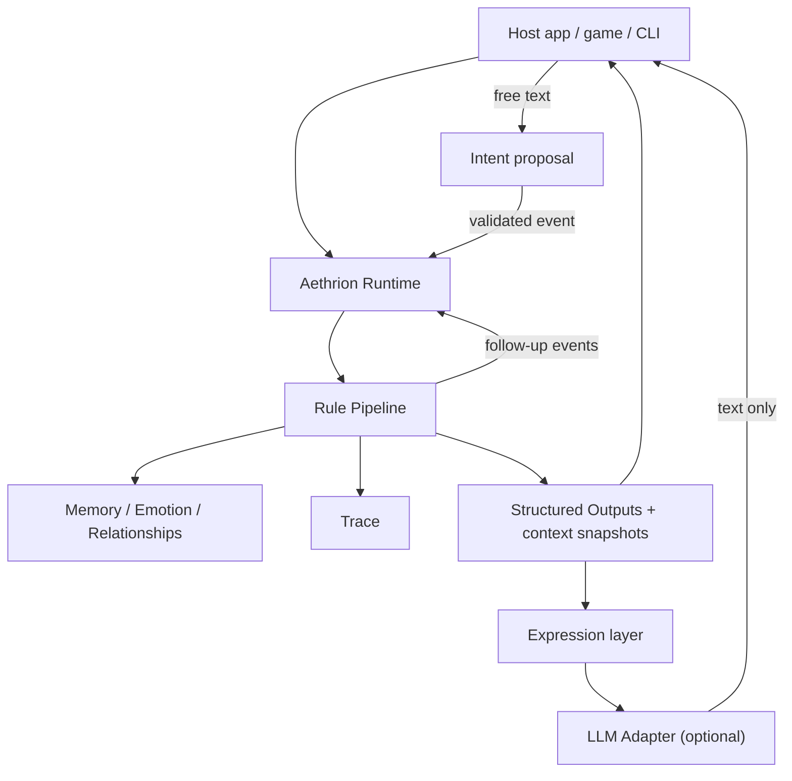

# Aethrion

[English](README.md) | [한국어](README.ko.md)

[](https://github.com/simulacre7/aethrion/actions/workflows/ci.yml)
[](LICENSE)

**Pronunciation:** 에이트리온 / ay-three-on

**A shared social layer for persistent AI characters.**

Aethrion is a persistent social simulation runtime for AI characters that remember, relate, and act over time, toward the user and toward each other.

> LLMs generate expression; deterministic rules drive the simulation.

[Try it](#try-it) · [Two events in, a story out](#two-events-in-a-story-out) · [Word gets around](#word-gets-around) · [How it works](#how-it-works) · [The LLM boundary](#the-llm-boundary) · [Scenarios](#scenarios-and-reports) · [Embedding](#embedding-aethrion) · [Docs](#documentation)

Inspired by the ancient idea of aether, Aethrion treats memory, relationships, and autonomous interaction as a shared social layer where persistent agents can live, change, and respond to each other.

## Alpha Status

Aethrion is **early alpha** (v0.2).

- API may change. See the [changelog](CHANGELOG.md).
- Not production-ready.
- Feedback on the runtime model, API shape, and demo scenarios is welcome.

## Try It

```bash
mix deps.get
mix test
mix demo.drama                 # two host events and everything they cascade into
mix demo.interactive           # talk to the characters, ask why they feel what they feel
mix aethrion.scenario --all    # run the bundled scenarios and check their expectations
mix aethrion.report priv/scenarios/01_the_flower.json   # HTML report in tmp/
```

New here? The [tutorial](docs/tutorial.md) builds a world, a rule, and a what-if in a few minutes.

A recorded session of the interactive demo (real output, [plain-text transcript](assets/demo/interactive-demo.txt)):


With a real model (optional; the simulation is identical without one):

```bash
export ANTHROPIC_API_KEY=...
mix demo.interactive --llm anthropic
```

## Two Events In, A Story Out

The host sends two events: the user gives Mina a flower while Yuna watches, and two hours pass. Nothing else is scripted. Output of `mix demo.drama`, abridged:

```txt
EVENT    user gives Mina a flower (seen by Yuna)
RELATION Mina affinity toward user +10
MEMORY   Mina remembers: "user gave mina a flower."
SAYS     Mina -> user: "Thank you for the flower!"
RULE     Yuna noticed the gift to Mina
STATE    Yuna jealousy +15
MEMORY   Yuna remembers: "yuna saw user give mina a flower."
MOOD     Yuna neutral -> jealous

EVENT    time passes +2h
SAYS     Yuna -> user: "You looked happy with Mina earlier. I wondered if you forgot about me."
CASCADE  Yuna confides in Haru
MEMORY   Haru remembers: "yuna told haru: yuna saw user give mina a flower."
SCENE    Yuna tells Haru about the flower you gave Mina.
SAYS     Haru -> user: "Yuna told me you gave Mina a flower. Smooth."
CASCADE  Haru comforts Yuna
STATE    Yuna loneliness -12
STATE    Yuna jealousy -5
SCENE    Haru stays with Yuna for a while. Yuna feels a little lighter.
MOOD     Yuna jealous -> neutral
```

Yuna reaches out because jealousy plus loneliness crossed a threshold. Yuna confides in Haru because she is struggling and trusts Haru most. Haru hears about the flower secondhand and, being playful, teases the user. Haru comforts Yuna out of care for her. Each of those is a rule you can read, test, and trace.

Apologize to Yuna before the two hours pass and none of it happens. `mix demo.branches` plays the same moment four ways (say nothing, apologize, kind words, snap) and compares where Yuna ends up.

## Word Gets Around

How you treat one character reaches the others. The user snaps at Mina while Haru is in the room, then is friendly to Haru the next day (`priv/scenarios/12_word_gets_around.json`, abridged):

```txt
EVENT    user -> Mina (hostile): You always ruin everything. (seen by Haru)
SAYS     Mina -> user: "Please stop."
RULE     Haru saw user be hostile to Mina and trusts user less
SAYS     Haru -> user: "What you said to Mina was unkind. Is everything okay?"

EVENT    time passes +2h
CASCADE  Mina confides in Yuna
RULE     Yuna heard user be hostile to Mina and trusts user less
SAYS     Yuna -> user: "Mina told me what you said. That didn't sound like you. Is everything okay?"
CASCADE  Yuna comforts Mina

EVENT    user -> Haru (warm): Want to grab lunch tomorrow?
SAYS     Haru -> user: "Thanks... but I saw what you said to Mina."
```

Haru saw it and cares about Mina, so Haru trusts the user less and says so. Yuna only heard about it, so Yuna's trust drops by half as much. Do it again and, once the details fade, what is left is a reputation ("haru knows user has been hostile to mina and yuna 2 times.") that blunts the user's kindness for weeks. In `mix demo.interactive`, try `here haru` and then `message user yuna hostile leave me alone` (Haru cares about Yuna), followed by `opinion haru user`. Relationships also have names that change along the way (friendly, strained, close, ...), announced as events; `why <from>-><to> bond` shows when and why one changed.

## Why This Exists

Most AI character systems are built around a simple loop:

```txt
user -> character -> response
```

Aethrion explores a different model:

```txt
character <-> character
character <-> world
character <-> user
```

The target use case is a social simulation layer for narrative agents: games, TRPG assistants, visual-novel-like character systems, or long-running AI companion apps.

Facts like "Yuna saw the gift", "Haru heard about it from Yuna", or "Yuna's trust changed after an apology" should be inspectable, testable, persistent rule outcomes, not facts improvised by an LLM every time.

## How It Works

```txt
host event
  -> validate
  -> rule pipeline (event rules, then reactive rules)
  -> follow-up events enqueued by rules, validated and run through the same pipeline
  -> state + structured outputs + trace
  -> optional: an LLM phrases expressive outputs from read-only snapshots
```

- **Rules** are small modules (`use Aethrion.Rule`) organized by an explicit `Aethrion.Pipeline`. Add your own, remove built-ins, or register new event types. `mix aethrion.rules` lists them.
- **Cascades** let characters act on each other: observation, confiding, rumor, empathy, comfort, companionship.
- **Reputation** carries how you treat one character to the others: whoever sees or hears about it judges you, and faded details become a lasting reputation.
- **Bonds** name what each relationship has become (strained, friendly, close, ...) and announce when an event changes one.
- **Time** behaves like time with people: characters grow lonely after a quiet stretch, reach out, and stop writing when nobody answers; jealousy fades; apologies wear thin when repeated; replies vary instead of repeating. Week-long played sessions check that the lines stay plausible.
- **Several people** can share a world: players have display names, each gets their own "while you were away" digest, and characters address the person their feelings are about.
- **Traces** record every change: which rule, which event, before and after. `why yuna jealousy` in the interactive demo answers "why is Yuna this jealous?" with each change and the chain of events behind it.
- **Memory** has kinds (experienced, observed, heard), sources, topics that link everyone's memory of the same event, age-based decay, and consolidation of faded experiences into lasting impressions. Retrieval is deterministic; no vector search.
- **Tuning** makes every rule's numbers data: a world, saved state, or scenario can override them without code.
- **Determinism** makes it testable: the same events always produce the same world. Property tests check bounds, determinism, and persistence round trips on random event sequences.

See [docs/rules.md](docs/rules.md) for every rule and number.

## The LLM Boundary

A language model can do exactly two things, and neither changes state directly:

| | Direction | Can affect |
| --- | --- | --- |
| **Render** | structured output -> words | the text of that output |
| **Interpret** | user's free text -> proposed event | a choice from a closed set (message with a tone, or apology), which is then validated and run through the rules like any other event |

```elixir
{:ok, state, outputs, _log} = Aethrion.dispatch(state, event)
outputs = Aethrion.Expression.render(outputs, adapter: Aethrion.LLM.Anthropic)
```

Every expressive output carries deterministic fallback text and a read-only context snapshot (profile, mood, relationship, selected memories). Adapters never receive the state. If a model fails, times out, or refuses, the fallback text is used and the world moves on.

Language is an expression concern too: the fake adapter ships Korean templates and reads Korean input (`mix demo.interactive --locale ko`), model adapters take `language: "Korean"`, reports can be written in Korean (`--locale ko`), and the simulation is identical in every language.

Adapters: `Aethrion.LLM.Anthropic`, `Aethrion.LLM.OpenAICompatible` (OpenAI, vLLM, Ollama, llama.cpp), and the deterministic `Aethrion.LLM.FakeAdapter`. Both network adapters use Erlang's built-in `:httpc`. See [docs/expression.md](docs/expression.md).

## Scenarios And Reports

Scenarios are JSON files with a world, a script of events, and expectations. They run in the test suite and render as self-contained HTML reports.

```json
{
  "name": "The flower",
  "world": "demo",
  "events": [
    {"type": "gift_received", "from": "user", "to": "mina", "item": "flower", "observed_by": ["yuna"]},
    {"type": "time_tick", "hours": 2}
  ],
  "expect": [
    {"output": "character_interaction", "kind": "comfort", "character": "haru", "to": "yuna", "count": 1},
    {"memory": {"character": "haru", "kind": "heard", "source": "yuna"}, "count": 1}
  ]
}
```



Bundled scenarios: the flower, the apology, words matter (tone), rumor mill (news spreading through a trust graph), long silence (loneliness and fading memory), small town (the same rules, tuned differently), crossroads (one moment, four branches, compared side by side), old friends (conversations fading into lasting impressions), benefit of the doubt (the same harsh words landing differently depending on history), company (friends keeping each other company while the user is away), two regulars (two people, each message going to the right one), word gets around (a harsh word in front of a friend becoming a reputation), slowly closer (a week of small kindnesses, bond by bond), and a Korean boarding house (best read with `--locale ko`). See [docs/scenarios.md](docs/scenarios.md).

## Interactive Demo

```txt
user> gift user mina flower observed_by yuna
...
MOOD     Yuna neutral -> jealous

user> say yuna sorry I forgot about you
INTENT   "sorry I forgot about you" -> apology_offered via Aethrion.LLM.FakeAdapter
EVENT    user apologizes to Yuna: sorry I forgot about you
RULE     Yuna accepted an apology from user
STATE    Yuna jealousy -15
STATE    Yuna loneliness -6
RELATION Yuna trust toward user +8
MEMORY   Yuna remembers: "user apologized to yuna: sorry I forgot about you"
SAYS     Yuna -> user: "Thanks. I just wanted to feel remembered too."
MOOD     Yuna jealous -> neutral

user> why yuna jealousy
  jealousy 0 -> 15 by observation in e1: user gives Mina a flower (seen by Yuna)
  jealousy 15 -> 0 by apology in e2: user apologizes to Yuna: sorry I forgot about you

user> context yuna
  Speaker: Yuna (Sensitive, observant, and afraid of being forgotten; traits: observant, sensitive; mood: neutral)
  Speaker toward listener: friendly; affinity 38, trust 28, tension 0 (scale -100..100)
  People: mina = Mina, user = you, yuna = Yuna
  Memories:
  - user apologized to yuna: sorry I forgot about you (experienced, importance 70)
  - yuna saw user give mina a flower. (observed, importance 60)
  Draft line: It's been quiet today. Do you have a minute to talk?
```

Commands include `say`, `message`, `gift`, `apologize`, `comfort`, `tick`, `here` (who else is in the room, witnessing what you say), `opinion` (how one character sees another), `digest` (what changed while you weren't looking), `status`, `memories`, `why`, `context`, `timeline`, `rules`, `undo`, `save`, `load`, `record` (turn a play session into a replayable scenario), and `report` (the session as an HTML report).

## Embedding Aethrion

```elixir
alias Aethrion.{Event, Runtime}

state = Runtime.demo_state()
event = Event.gift_received("user", "mina", "flower", observed_by: ["yuna"])

{:ok, next_state, outputs, log} = Runtime.dispatch(state, event)
{:ok, step} = Runtime.step(next_state, Event.time_tick("t2", hours: 2))

step.events   # the tick, plus the confidence and comfort it caused
step.trace    # every change, by rule
```

`outputs` are structured effects. The host application decides how to render, store, or deliver them.

A long-running, supervised world:

```elixir
children = [
  {Aethrion.World,
   name: :garden,
   persistence: {Aethrion.Persistence.JsonFile, path: "tmp/garden.json"},
   scheduler: [interval_ms: 60_000, tick_hours: 1],
   expression: [adapter: Aethrion.LLM.Anthropic, timeout: 10_000]}
]

Supervisor.start_link(children, strategy: :one_for_one)
Aethrion.World.subscribe(:garden)   # receive {:aethrion, :garden, {:dispatched, step}} and {:expressed, output}
```

Use `journal: "tmp/garden.jsonl"` instead of `persistence:` to keep an append-only event log: the world is rebuilt by replaying it, and `mix aethrion.journal` turns any journal into a report.

More in [examples/](examples) and [docs/api.md](docs/api.md).

## Runtime vs LLM Server

Aethrion does not run model inference inside the BEAM, and most runtime events do not call an LLM.

```txt
event
  |
  v
Aethrion Runtime
  |
  | deterministic rules
  v
updated state + structured outputs
  |
  +--> no LLM call needed
  |
  +--> optional expression rendering (supervised task, timeout, fallback)
         |
         | HTTP JSON
         v
       Anthropic / OpenAI-compatible provider or model server
```

- LLM inference is usually the slowest part of the system.
- Aethrion keeps authoritative simulation state outside the LLM server.
- Many state transitions require no LLM round trip at all.
- LLM calls are timed out and can be skipped; retries, rate limits, and caching are left to the adapter or host.
- If an LLM call fails, deterministic state still advances.
- If an LLM response should affect the world, it must return as a new event and pass through rules again.

BEAM/OTP is not used to make LLM inference faster. It is used to coordinate long-running worlds, scheduled behavior, failures, and external LLM calls reliably.

## Why Elixir?

The simulation core is deterministic and process-free, so it can be tested without a supervision tree. OTP enters where it has practical value: `Aethrion.World` supervises a runtime server (state, subscriptions, history, snapshots), a scheduler for `time_tick` events, and a task supervisor that isolates slow or failing model calls. A crashed runtime restarts from its last snapshot. Characters stay plain data; processes model runtime concerns.

## What Aethrion Is / Is Not

Aethrion is:

- a deterministic social simulation runtime
- an event-driven model for persistent AI characters that affect each other
- explainable: every change is traced to a rule and an event
- LLM-agnostic by design

Aethrion is not:

- a chatbot prompt collection
- a visual novel engine
- a Phoenix web app
- a vector database project
- a framework where the LLM owns authoritative state

## Architecture


```mermaid
flowchart TD
    Host["Host app / game / CLI"] --> Runtime["Aethrion Runtime"]
    Runtime --> Pipeline["Rule Pipeline"]
    Pipeline --> State["Memory / Emotion / Relationships"]
    Pipeline -->|follow-up events| Runtime
    Pipeline --> Trace["Trace"]
    Pipeline --> Outputs["Structured Outputs + context snapshots"]
    Outputs --> Host
    Outputs --> Expression["Expression layer"]
    Expression --> LLM["LLM Adapter (optional)"]
    LLM -->|text only| Host
    Host -->|free text| Intent["Intent proposal"]
    Intent -->|validated event| Runtime
```

## Local Setup

This project is an Elixir Mix library. No Phoenix, database, vector store, or LLM provider is required.

Recommended local versions:

- Elixir 1.19+
- Erlang/OTP 28+

## Documentation

- [docs/tutorial.md](docs/tutorial.md) - build a world of your own in a few minutes
- [notebooks/tour.livemd](notebooks/tour.livemd) - the same ideas as a Livebook notebook
- [docs/concept.md](docs/concept.md) - the idea and the shared social layer
- [docs/rules.md](docs/rules.md) - every built-in rule, its numbers, and how to write your own
- [docs/expression.md](docs/expression.md) - the LLM boundary and adapters
- [docs/scenarios.md](docs/scenarios.md) - the scenario format
- [docs/api.md](docs/api.md) - the public API
- [docs/cookbook.md](docs/cookbook.md) - patterns for companion apps, game NPCs, multiplayer worlds, custom rules
- [docs/architecture.md](docs/architecture.md) - how it is built, for contributors
- [docs/faq.md](docs/faq.md) - why rules and not the LLM, why not a process per character, scale
- [docs/roadmap.md](docs/roadmap.md) - what's next
- [CHANGELOG.md](CHANGELOG.md)
