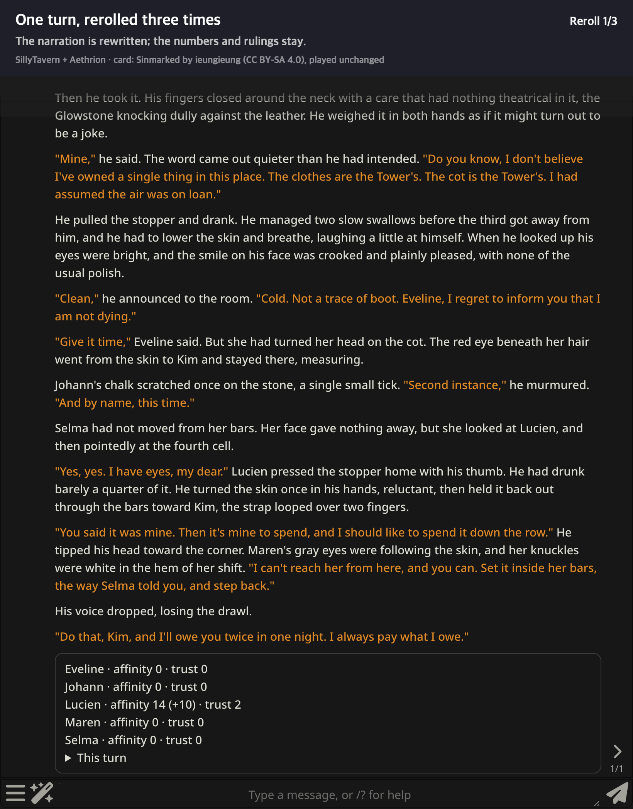
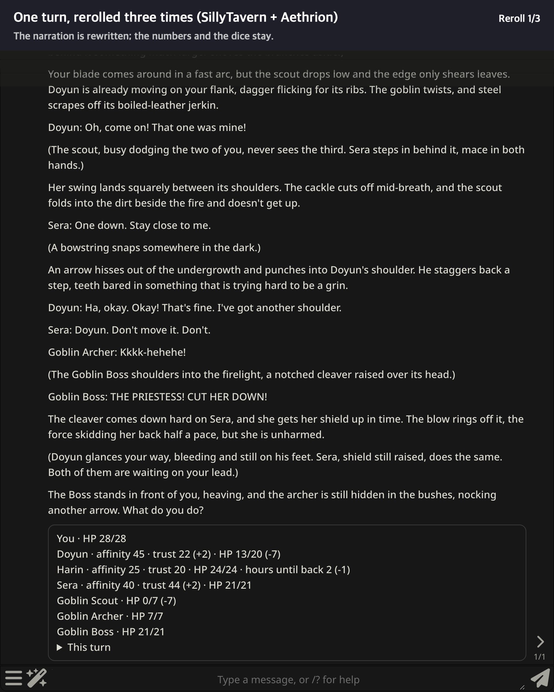
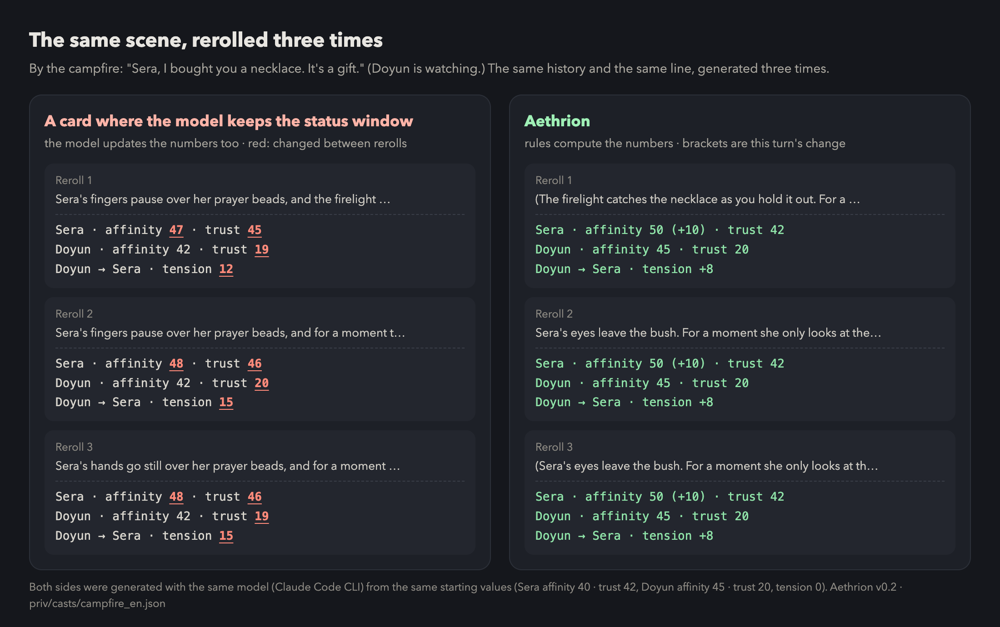
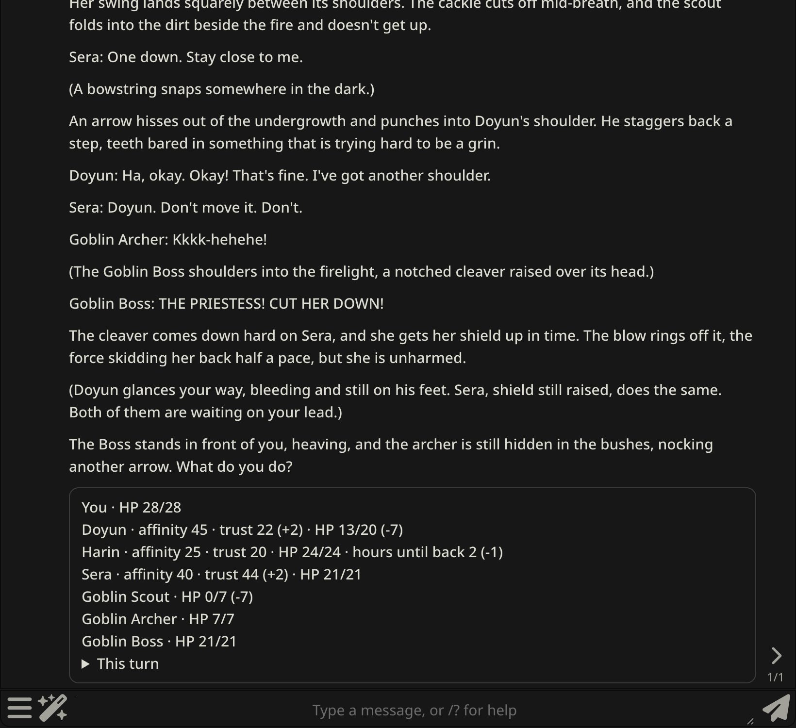

# Aethrion

[English](README.md) | [한국어](README.ko.md)

[](https://github.com/simulacre7/aethrion/actions/workflows/ci.yml)
[](LICENSE)

**Rules keep the story straight. Your model tells it.**

Aethrion keeps the facts of an AI role-play in deterministic rules: affinity and trust, HP and dice, who saw what, who told whom, and which ending you are heading for. Any model then narrates the result. Use it as the Custom API in RisuAI or SillyTavern, or put it behind your own chat app or game.



<sub>The card [Sinmarked](https://realm.risuai.net/character/387a703e-8122-4d7a-8e34-069ebb26d0bc) from RisuRealm (by ieungieung, CC BY-SA 4.0), played unchanged in SillyTavern. Only the request model name was set, to `aethrion-auto`. One turn is rerolled three times, and the last frame unfolds "this turn" under the status window.</sub>

<sub>Pronounced ay-three-on (에이트리온). A personal project, not affiliated with RisuAI or SillyTavern. MIT licensed, early alpha.</sub>

## Keep The Card You Already Use

A card you already play in RisuAI or SillyTavern needs no editing and no import. Set the request model to `aethrion-auto`.

[Sinmarked](https://realm.risuai.net/character/387a703e-8122-4d7a-8e34-069ebb26d0bc), above, is an ensemble card with five prisoners. The player, their new jailer, hands a waterskin to one of them, Lucien, and that turn is rerolled three times. The narration differs each time; the rulings do not.

```txt
You:  I pass the waterskin through the bars. "Lucien, take it. It's yours."
      Lucien · affinity 14 (+10) · trust 2
      Selma · affinity 0 · trust 0        (Eveline, Johann, and Maren the same)
      Read · a gift for Lucien: waterskin
      Seen by · Eveline, Johann, Maren, Selma
```

- **The card is read once.** On a new card's first reply, Aethrion reads the card and takes the people in it and how each feels about the player at the start: an old friend starts high, a stranger at 0.
- **Then the rules keep count.** Affinity, trust, memories, and who saw what are the rules'. A reroll leaves the numbers alone.
- **People may turn up as the story goes.** With a narrator card (an open-world RPG, say) the model says, with each reply, who is with the player. Someone new joins the cast and has numbers from the next turn, and someone who has left does not see what the player does.
- **The card works as before, and its status window stops drifting.** Its prompt, lorebook, and assets stay. A status window the card has the model print (level, HP, money, an inventory) is kept by the rules from the second reply on: the model says what changed, and Aethrion keeps the books in the card's own format. Arithmetic the card states (a maximum per stat point, the EXP a level takes, how far trust may move in a turn) is worked out by the rules, not from the model's memory. Where the card's window counts how its people feel, that count is the one shown, and Aethrion's own affinity and trust stay out of the way. Over a thirty-turn session with a popular RPG card, a small model alone broke the card's rules in every turn and reached level 44; with the ledger none of the card's rules was broken in thirty turns, and rerolls gave the same window ([the numbers](docs/ledger-benchmark.md)).

Checked with an ensemble card (Sinmarked), a one-on-one card, a dating-sim card with a fixed set of people, a raising-sim card with its own status window, and two narrator RPG cards. Not there yet:

- A line said on the turn someone first appears is not read as said to them. From the next turn it is.
- What comes by itself is affinity, trust, memories, and the card's own window kept straight. How much a kill gives or a blow costs is the model's to say, once: a reroll keeps the numbers of the turn's first answer. Fights with dice and endings need [a cast made in the editor](docs/stories.md#building-a-world).
- A new card's first turn takes longer: the card is read first, three times at once (three model calls, once a card).

More in the [RisuAI guide](docs/risuai.md#keep-the-card-you-already-use).

## The Problem

Long role-play and simulation chats usually leave the state to the model: the card asks it to print a status window at the end of every reply and to remember it. That breaks in familiar ways.

- **A reroll (regenerating the reply) counts twice.** Regenerate an attack and the damage lands again. Regenerate a compliment and affinity rises again.
- **Numbers drift.** Fifty turns in, HP has quietly come back and the trust you earned is gone.
- **Characters know what they never saw.** A gift given in private is suddenly common knowledge.
- **The dice follow the model's mood.** The same blow hits once and misses the next time.

## What Aethrion Does

Aethrion reads each line the player types, applies it with rules, and hands the model the outcome as facts to narrate. The same chat always gives the same state, so:

- a reroll changes the wording, never the outcome
- an edited line is recomputed from that point on
- characters know only what they saw or were told, and pass it on to the people they trust
- the status window shows what this turn changed (`Sera · affinity 50 (+10)`)
- under it, this turn's rulings show the rules' work: how the line was read, who saw it, and every dice roll (`[d20 6+5=11 vs AC 15, miss.]`), proof that the numbers are computed, not written by the model



<sub>The bundled campfire cast in SillyTavern, one turn rerolled three times. A cast made for Aethrion has HP and dice in the rules too. The last frame unfolds "this turn" under the status window.</sub>



<sub>The same scene from the campfire cast, rerolled three times with the same model (the Claude Code CLI) and the same starting values. Left: a plain card where the model updates the status window. Right: Aethrion. Raw outputs: [assets/demo/reroll.en.json](assets/demo/reroll.en.json)</sub>

From a play of the bundled campfire cast, with the Claude Code CLI as the narrator. The prose is the model's; every number, and who did what, is the rules':

```txt
You:  Sera, I bought you a necklace. It's a gift.
      …On the far side of the fire, Doyun has gone very still. He saw all of it. He looks at the
      necklace, then at Sera, and his jaw tightens before he turns away. …
      Sera · affinity 50 (+10) · trust 42   Doyun → Harin · trust +7 · affinity +3   Doyun → Sera · tension +8
You:  I slash at the goblin scout.
      …She slips around the edge of the firelight with the necklace chain looped tight around her
      knuckles, finds the opening you and Doyun have made, and strikes once, cleanly. …
      [d20 15/17→17+4=21 vs AC 15 (advantage), hit. 1d6+2 (5)] Sera hits Goblin Scout for 7.
```

Doyun saw the necklace, so he grows jealous and sends word to Harin, who is out scouting. The gift lifts Sera's care for you just past the line where she takes the goblins' blows for you. Fight without giving it and she never does.

A real play in SillyTavern. The narration streams in as it is written, and the status window comes last:



## Who It Is For

| You are | Start here |
| --- | --- |
| A RisuAI or SillyTavern player or card maker | [Use Aethrion as a Custom API](docs/risuai.md): keep your card with the request model `aethrion-auto`, or import it to add stats and endings |
| Building a character chat app or a game | [Run it as an HTTP server](docs/embedding.md#chat-apps-and-games): one world per user, from any language |
| An Elixir developer | [Embed the runtime](docs/embedding.md#embedding-aethrion) and write your own rules |

## Quick Start

**With Docker, no Elixir needed.** It works with RisuAI's desktop app or SillyTavern (RisuAI's web app cannot reach a server on your computer):

```bash
git clone https://github.com/simulacre7/aethrion && cd aethrion
cp .env.example .env     # an access password, and your model: OpenRouter, the Claude API, Ollama, ...
docker compose up -d
```

Then open http://localhost:4848 and click **RisuAI**: it shows the values to copy and downloads the character card. Point RisuAI's Custom API at `http://localhost:4848/v1`, with the access password as its key ([step by step](docs/risuai.md#the-quick-way-docker)). Tested with RisuAI's desktop app 2026.8.250 on macOS and SillyTavern 1.19.0.

**With Elixir** (1.19+ and Erlang/OTP 28+; `brew install elixir` on macOS). No database or vector store is needed, and a model is optional.

```bash
mix deps.get
mix demo.drama      # two events in, a small social drama out; no model needed
mix aethrion.serve --cast priv/casts/campfire_en.json --llm claude   # campfire.json --locale ko for Korean
```

Then open http://localhost:4848 to chat, or http://localhost:4848/editor to edit the cast, or point RisuAI at `http://localhost:4848/v1` ([setup](docs/risuai.md)).

`--llm` picks the narrator:

- `claude` or `codex`: the CLI on this machine, as signed in, with no key
- `ollama`, `lmstudio`, or `llamacpp`: a local model
- `anthropic`: the Claude API
- `openai --base-url ...`: any OpenAI-compatible API

Without `--llm`, keyword rules and templates stand in. That is for tests and development, not what play looks like.

## What You Can Build

- **Characters who affect each other.** A gift makes someone else jealous, a confidence spreads as a rumor, and friends comfort each other while you are away. ([tour](docs/tour.md))
- **Reputation and bonds.** How you treat one character reaches the others. Relationships have names that change along the way: strained, friendly, close. ([tour](docs/tour.md#word-gets-around))
- **Endings by the numbers.** Raising-sim stats and activities, endings with a hint of what is still missing, and messenger-style bond stories. ([stories](docs/stories.md))
- **Fights.** HP, guarding, healing, and the d20 rules of the D&D 5e SRD. Companions fight beside you only if they trust you. ([stories](docs/stories.md#endings-and-fights))
- **A cast editor and route simulator** at `/editor`. Write a route the way a player chats and see which ending it reaches. ([stories](docs/stories.md#authoring-worlds))
- **Bundled casts**, most in Korean:
  - `campfire_en`: the campfire party in English
  - `summer`: a raising sim
  - `quest`: a hunt for the wolf king
  - `den`: a D&D wolf den
  - `academy`: a messenger academy
  - `campfire`: a party by the fire

## How It Works

```txt
player's line -> read as an event -> rules -> new state + a trace of every change
                                                  |
                                     the model narrates the outcome (text only)
```

A model does two things, and neither changes the state directly. It reads what a line means, by picking from a closed set of choices that the rules then check. It also writes how the outcome sounds. If it fails or times out, fallback text is used and the world still moves on. See [the LLM boundary](docs/embedding.md#the-llm-boundary).

## Status

Aethrion is **early alpha** (v0.2). The API may change; see the [changelog](CHANGELOG.md). It is not production-ready. Feedback is welcome, especially from people who play long role-play chats or build character apps: [open an issue](https://github.com/simulacre7/aethrion/issues).

## Documentation

- [docs/risuai.md](docs/risuai.md): Aethrion as the model in RisuAI or SillyTavern
- [docs/tour.md](docs/tour.md): the simulation with real output (cascades, reputation, scenarios, the interactive demo)
- [docs/stories.md](docs/stories.md): endings, fights, bond stories, the cast editor, how chat lines are read
- [docs/embedding.md](docs/embedding.md): Aethrion in an Elixir app, the HTTP API, the LLM boundary, architecture
- [docs/tutorial.md](docs/tutorial.md): build a world of your own in a few minutes
- [notebooks/tour.livemd](notebooks/tour.livemd): the same ideas as a Livebook notebook
- [docs/concept.md](docs/concept.md): the idea and the shared social layer
- [docs/rules.md](docs/rules.md): every built-in rule, its numbers, and how to write your own
- [docs/expression.md](docs/expression.md): the LLM boundary and adapters
- [docs/scenarios.md](docs/scenarios.md): the scenario format
- [docs/api.md](docs/api.md): the public API
- [docs/cookbook.md](docs/cookbook.md): patterns for companion apps, game NPCs, multiplayer worlds, custom rules
- [docs/architecture.md](docs/architecture.md): how it is built, for contributors
- [docs/faq.md](docs/faq.md): why rules and not the LLM, why not a process per character, scale
- [docs/roadmap.md](docs/roadmap.md): what's next
- [CHANGELOG.md](CHANGELOG.md)
