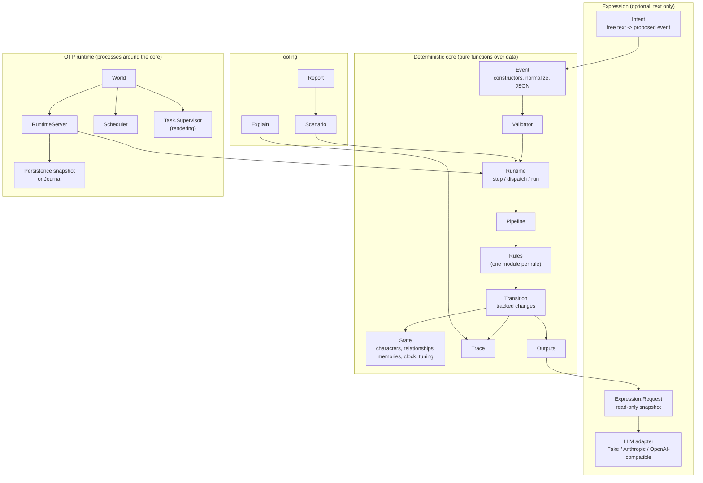

# Architecture

How Aethrion is put together, for people changing it. For using it, start with the [tutorial](tutorial.md) and the [API reference](api.md).

## Layers

The core never performs I/O, reads the wall clock, or uses randomness. Everything that does (files, HTTP, timers, processes) lives in the outer layers and calls into the core.

## Lifecycle of one host event

1. **Normalize.** `Event.normalize/1` fills optional fields (`:at`, `:now`, `:observed_by`, `:tone`).
2. **Validate.** `Validator` checks the type is registered in the pipeline and, for built-in types, every field. Invalid events return `{:error, %Aethrion.Error{}}` and never touch state.
3. **Assign an id.** `state.seq` is incremented; the event becomes `"e<seq>"`.
4. **Run rules.** For the event's type, `Pipeline.rules_for/2` returns the event rules followed by the reactive rules. Each rule receives a `Transition` and returns it. Rules change state only through `Transition` helpers, each of which clamps, records a `Trace` entry tagged with the rule id and event id, and where it applies emits an output and a log line.
5. **Collect follow-ups.** Rules may `enqueue/2` events (a confidence, comfort, an outing). They carry `:cause` and go through steps 1-4 themselves, breadth-first, until the queue is empty or a limit is hit (`max_depth`, `max_events`). Dropped follow-ups are logged and traced.
6. **Return a `Step`**: the final state, every processed event, outputs, log, and trace.

## Determinism

The same state, event, pipeline, and limits always produce the same `Step`. This is what makes scenarios, journals, branches, and property tests possible. To keep it:

- Iterate characters with `State.sorted_characters/1`; never rely on map order.
- Break ties explicitly (by id) whenever sorting by a score.
- Derive time from `state.clock`, never the system clock. Quantities that accumulate over time (memory decay, tension easing) are computed from absolute clock values or day boundaries so they do not depend on how time was split into ticks.
- Keep rule numbers in `params` and read them with `Transition.param/2`, so a world's tuning is part of its state.

`mix test` includes property tests that replay random event sequences and check that results are identical, bounded, persistable, journal-replayable, and recordable as passing scenarios.

## State

`Aethrion.State` is plain data:

| field | notes |
| --- | --- |
| `characters` | `%{id => %Character{}}`; each has a `%CharacterState{}` with bounded numbers and a derived `mood` |
| `relationships` | `%{{from, to} => %Relationship{}}`, directed; missing pairs read as all zeros |
| `memories` | newest first; each has a `topic` linking everyone's memory of one event |
| `clock`, `seq` | simulated hours; processed event count |
| `cooldowns` | `%{key => clock}` for rate-limited behaviors |
| `tuning` | rule parameter overrides |

`State.to_data/1` and `State.parse/2` convert to and from JSON-friendly data. Parsing validates untrusted input and never creates atoms.

## Memory

Memories are created by rules (`remember/3`), decay with age (`MemoryDecay`), fold into impressions when faded (`Consolidation`), and are eventually forgotten. Retrieval (`Aethrion.Memories`) is a deterministic score over strength, focus, and recency: no embeddings. Memory work runs on every tick, so rules that touch memories use single passes (`Transition.map_memories/4`, `drop_memories/2`) and per-application indexes rather than per-character rescans.

## The expression boundary

Rules attach deterministic fallback text and an `Expression.Request` snapshot to every expressive output. `Expression.render/2` passes only that snapshot to an adapter and only replaces text. `Intent.interpret/3` lets an adapter choose from a closed set of proposals; the result is an ordinary event that still goes through validation and rules. Adapters never see `State`, and the tests assert it.

## OTP

`Aethrion.World` supervises, with `:rest_for_one`:

1. a `Task.Supervisor` for rendering,
2. an `Aethrion.RuntimeServer` that owns the state, subscribers, history, and storage,
3. an optional `Aethrion.Scheduler` that dispatches `time_tick` events.

The server calls `Runtime.step/3`, writes the journal (if any) before committing the new state, saves snapshots (if any), broadcasts to subscribers, and starts rendering tasks with timeouts. A crashing rule rejects the event; a crashing or slow adapter produces fallback text; a crashing server restarts from its snapshot or journal.

## Process boundaries and their tradeoffs

Aethrion uses one process per *world*, not per character. The alternatives were considered and deferred for these reasons.

**What one event needs.** A single gift changes the receiver, every observer, and their relationships; a hostile message changes the receiver and every witness's view of the sender; a tick can enqueue a dozen follow-ups across the cast, processed breadth-first. Every rule reads the state that earlier rules in the same step produced, and the step's trace and outputs describe one consistent transition.

**What per-character processes would cost.**

| concern | one world process (today) | a process per character |
| --- | --- | --- |
| consistency | a step is one function over one value | a gift touches several mailboxes; needs a coordinator or a commit protocol to avoid half-applied events |
| ordering | follow-ups run breadth-first in a fixed order | message interleaving between characters varies run to run |
| determinism | same input, same state, trace, and outputs | would have to record the interleaving to replay a journal |
| trace | built as the step runs | assembled from several processes after the fact |
| snapshots | the state is the snapshot | a consistent cut across processes |
| failure | a raising rule rejects the event, state untouched | partial updates to roll back |

**What they would buy.** Parallel rule execution, isolation of one character's work, and a natural shape for distribution. At the current scale none of these is needed: a step takes under a millisecond for ordinary events and tens of milliseconds for a busy tick in a 200-character world (see `bench/dispatch.exs`), failures are already isolated per event, and timers live in the scheduler.

**Where processes are used instead.** Around the core, where concurrency is real: the runtime server serializes events for a world and owns subscribers and storage; the scheduler owns time; rendering runs in supervised tasks so a slow or failing model never blocks the simulation. Independent worlds (for example one per user or per room) are independent `Aethrion.World` trees and scale out naturally.

**When to revisit.** If one world's step time becomes the bottleneck (thousands of active characters in one shared world), the next step would be partitioning a world into loosely coupled regions with explicit, logged messages between them, keeping each region deterministic. Characters that must be shared across many worlds (one persona talking to many users) are better modeled as shared read-only profiles plus per-world state than as a single process.

## Adding things

| to add | touch |
| --- | --- |
| a rule | a module with `use Aethrion.Rule`; register it in `Pipeline.default/0` (or a host pipeline); document it in `docs/rules.md`; add a scenario |
| an event type | a constructor, `describe/2`, and `from_data` builder in `Event`; `Templates.Ko.describe_event/2`; validation in `Validator`; the scenario schema; docs |
| an impression pattern | `interaction/1` in `Rules.Consolidation` and its content line; history effects in the rule that reads it |
| an output type | a constructor in `Output`; `Display` and `Report` rendering; docs |
| a template line | `Expression.Templates` and `Expression.Templates.Ko` (the words); `Expression.Choices` when the line depends on the situation (which line fits, shared by both languages) |
| a report string | `english/1` and `korean/1` in `Report` (English output must stay byte-identical) |
| a digest line | `Digest`, in both languages |
| an LLM provider | a module implementing `Aethrion.LLM.Adapter`, using `Expression.Prompt` and `LLM.HTTP` |
