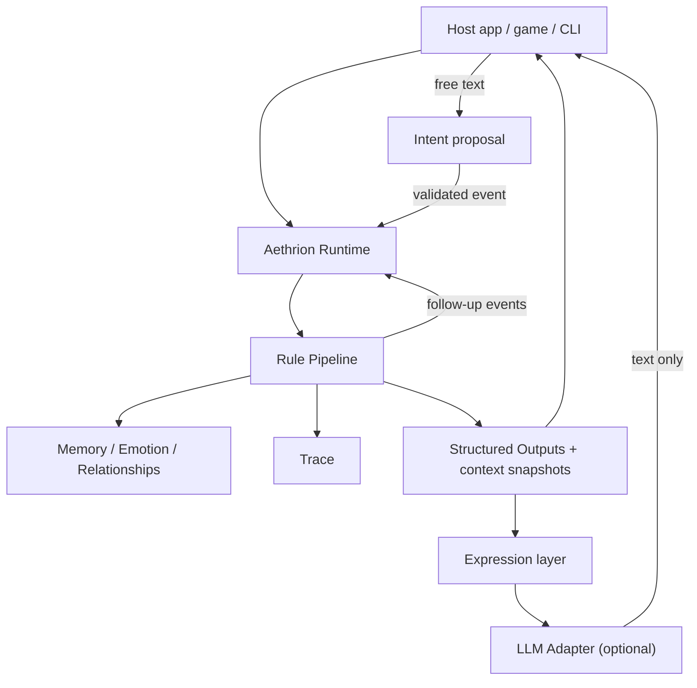

# 앱에서 Aethrion 쓰기

[English](embedding.md)

개발자용 문서입니다. Elixir 앱에 런타임을 넣는 법, 어떤 언어에서든 쓰는 사용자별 세계와 HTTP API, 모델이 들어가는 자리, 그리고 왜 Elixir인지 다룹니다.

## Elixir 앱에서 사용하기

```elixir
alias Aethrion.{Event, Runtime}

state = Runtime.demo_state()
event = Event.gift_received("user", "mina", "flower", observed_by: ["yuna"])

{:ok, next_state, outputs, log} = Runtime.dispatch(state, event)
{:ok, step} = Runtime.step(next_state, Event.time_tick("t2", hours: 2))

step.events   # tick과, 그로 인해 이어진 털어놓기와 위로
step.trace    # 규칙별 모든 변화
```

`outputs`는 structured effect입니다. 이를 어떻게 렌더링하고 저장하고 전달할지는 host application이 결정합니다.

오래 실행되는 supervised world:

```elixir
children = [
  {Aethrion.World,
   name: :garden,
   persistence: {Aethrion.Persistence.JsonFile, path: "tmp/garden.json"},
   scheduler: [interval_ms: 60_000, tick_hours: 1],
   expression: [adapter: Aethrion.LLM.Anthropic, timeout: 10_000]}
]

Supervisor.start_link(children, strategy: :one_for_one)
Aethrion.World.subscribe(:garden)   # {:aethrion, :garden, {:dispatched, step}}, {:expressed, output} 수신
```

`persistence:` 대신 `journal: "tmp/garden.jsonl"`을 쓰면 추가 전용 이벤트 로그가 남습니다. 세계는 로그를 재생해 그대로 복원되고, `mix aethrion.journal`로 어떤 저널이든 리포트로 만들 수 있습니다.

더 많은 예시는 [examples/](../examples)와 [docs/api.md](api.md)에 있습니다.

## 채팅 앱과 게임에서 쓰기

위의 예시는 프로세스 하나에 세계 하나입니다. 채팅 앱이나 게임 서버에는 사용자(또는 세이브 슬롯, 방)마다 세계가 하나씩 필요하고, 대화가 이어져야 하며, 어떤 언어에서든 붙일 수 있어야 합니다.

**사용자마다 세계 하나.** `Aethrion.Worlds`는 키(사용자 id 문자열 같은 아무 값)마다 세계를 하나씩 둡니다. 처음 쓸 때 키로부터 시작하고, 한동안 안 쓰면 멈추며, 저널에 남아 있어 다시 켜면 그대로 돌아옵니다. 키를 atom으로 바꾸지 않으므로 사용자 수가 VM의 atom 한도에 묶이지 않습니다.

```elixir
children = [
  {Aethrion.Worlds,
   name: MyApp.Worlds,
   idle_after: :timer.minutes(30),
   world: fn user_id ->
     [initial_state: MyApp.Cast.state(),
      journal: "data/worlds/#{Aethrion.Worlds.file_name(user_id)}.jsonl",
      expression: [adapter: Aethrion.LLM.Anthropic, timeout: 10_000, adapter_opts: [language: "Korean"]]]
   end}
]

Aethrion.Worlds.subscribe(MyApp.Worlds, user_id)     # {:aethrion, {MyApp.Worlds, user_id}, payload}
Aethrion.Worlds.dispatch(MyApp.Worlds, user_id, event)
```

**대화.** 캐릭터는 사람마다 최근 대화를 기억합니다(`Aethrion.Conversation`). 답장을 쓰는 모델은 대화의 흐름과 각 말이 얼마나 전에 오갔는지, 그리고 규칙이 정한 태도("아직 최근 일로 서운함")를 봅니다. 그래서 실제로 한 말에 답하고, 캐릭터의 말투(`voice`)를 따르되 일어나지 않은 일을 지어내지 않습니다. 무엇이 일어나는지는 규칙이, 어떻게 들리는지만 모델이 정합니다. 모델이 한 말은 저널에 남으므로 다시 켠 세계는 사실뿐 아니라 그때 한 말까지 기억합니다. 사용자가 입력한 글은 인용된 데이터로 모델에 전달되어 프롬프트를 바꿀 수 없습니다.

**어떤 언어에서든.** `mix aethrion.serve`(또는 슈퍼비전 트리의 `Aethrion.API`)는 Erlang 내장 서버로 세계들을 JSON over HTTP로 제공합니다:

```bash
curl -s localhost:4848/worlds/alice/say -H 'content-type: application/json' \
  -d '{"to": "mina", "text": "좋은 아침!"}'

curl -s localhost:4848/worlds/alice/events -H 'content-type: application/json' \
  -d '{"type": "time_tick", "hours": 6}'      # 시간이 흐르면 캐릭터가 먼저 연락하고, 소문을 나누고, 서로 곁을 지킵니다
```

`say`는 자유 입력(이벤트로 해석)을, `events`는 시나리오에 쓸 수 있는 모든 이벤트를 받고, `GET /worlds/{key}/conversation?character=mina&after=e12`로 새 대사를 가져올 수 있습니다. bearer 토큰, localhost 바인딩, 크기 제한은 기본으로 켜져 있거나 옵션 하나로 켤 수 있습니다. [docs/api.md](api.md#http-api)와 [cookbook](cookbook.md)을 참고하세요.

## LLM 경계

언어 모델이 할 수 있는 일은 정확히 두 가지이며, 둘 다 상태를 직접 바꾸지 못합니다.

| | 방향 | 영향을 줄 수 있는 것 |
| --- | --- | --- |
| **Render** | structured output -> 문장 | 그 출력의 텍스트 |
| **Interpret** | 사용자의 자유 텍스트 -> 이벤트 제안 | 닫힌 선택지(톤이 있는 메시지, 또는 사과) 중 하나. 이후 다른 이벤트와 똑같이 검증되고 규칙을 통과합니다 |

```elixir
{:ok, state, outputs, _log} = Aethrion.dispatch(state, event)
outputs = Aethrion.Expression.render(outputs, adapter: Aethrion.LLM.Anthropic)
```

모든 표현형 출력은 결정론적 fallback 텍스트와 읽기 전용 컨텍스트 스냅샷(프로필, 기분, 관계, 선택된 기억)을 담고 있습니다. adapter는 state를 받지 않습니다. 모델이 실패하거나, 시간 초과되거나, 거절하면 fallback 텍스트가 쓰이고 세계는 계속 진행됩니다.

표현은 언어와도 분리되어 있습니다. `FakeAdapter`는 한국어 템플릿을 내장하고 있어(이름의 받침에 맞춰 조사를 고릅니다) `mix demo.interactive --locale ko`로 모든 대사를 한국어로도 볼 수 있습니다(데모 캐릭터는 한국어 줄에서 미나·유나·하루로 불립니다). 실제 모델과 함께 `--llm anthropic --locale ko`로 실행하면 모델이 한국어로 대사를 씁니다. 시뮬레이션 결과는 언어와 무관하게 동일합니다.

```txt
SAYS     Yuna -> user: "You looked happy with Mina earlier. I wondered if you forgot about me."
KO       유나: "아까 미나랑 있을 때 즐거워 보이더라. 혹시 나는 잊은 거 아니지?" (Aethrion.LLM.FakeAdapter)
```

Adapter: `Aethrion.LLM.Anthropic`, `Aethrion.LLM.OpenAICompatible`(OpenAI, vLLM, Ollama, llama.cpp), 그리고 결정론적인 `Aethrion.LLM.FakeAdapter`. 두 네트워크 adapter 모두 Erlang 내장 `:httpc`를 사용합니다. 자세한 내용은 [docs/expression.md](expression.md)를 참고하세요.

## Runtime vs LLM Server

Aethrion은 BEAM 내부에서 모델 추론을 실행하지 않으며, 대부분의 런타임 이벤트는 LLM을 호출하지 않습니다.

```txt
event
  |
  v
Aethrion Runtime
  |
  | deterministic rules
  v
updated state + structured outputs
  |
  +--> LLM 호출 불필요
  |
  +--> 선택적 expression rendering (supervised task, timeout, fallback)
         |
         | HTTP JSON
         v
       Anthropic / OpenAI 호환 provider 또는 model server
```

- LLM 추론은 보통 시스템에서 가장 느린 부분입니다.
- Aethrion은 권위 있는 시뮬레이션 상태를 LLM 서버 밖에 둡니다.
- 많은 상태 전이는 LLM 왕복이 전혀 필요 없습니다.
- LLM 호출에는 timeout이 걸리고 생략할 수 있습니다. retry, rate limit, cache는 adapter나 host의 몫입니다.
- LLM 호출이 실패해도 결정론적 상태는 계속 진행됩니다.
- LLM 응답이 세계에 영향을 주어야 한다면, 새 이벤트로 돌아와 규칙을 다시 통과해야 합니다.

BEAM/OTP는 LLM 추론을 빠르게 하기 위해 쓰는 것이 아닙니다. 오래 지속되는 세계, 예약된 행동, 장애, 외부 LLM 호출을 안정적으로 조율하기 위해 씁니다.

## 왜 Elixir인가?

시뮬레이션 코어는 결정론적이고 process-free이므로 supervision tree 없이 테스트할 수 있습니다. OTP는 실제 가치가 있는 곳에만 들어갑니다. `Aethrion.World`는 runtime server(상태, 구독, 히스토리, 스냅샷), `time_tick` 이벤트용 scheduler, 느리거나 실패하는 모델 호출을 격리하는 task supervisor를 함께 감독합니다. runtime이 죽으면 마지막 스냅샷에서 재시작합니다. 캐릭터는 plain data로 남고, 프로세스는 런타임 관심사를 모델링합니다.

## Aethrion이 하는 것 / 하지 않는 것

Aethrion은:

- 결정론적 소셜 시뮬레이션 런타임입니다
- 서로에게 영향을 주는 지속형 AI 캐릭터를 위한 이벤트 기반 모델입니다
- 설명 가능합니다: 모든 변화가 규칙과 이벤트로 추적됩니다
- 설계상 LLM에 종속되지 않습니다

Aethrion은:

- 챗봇 프롬프트 모음이 아닙니다
- 비주얼 노벨 엔진이 아닙니다
- Phoenix 웹 앱이 아닙니다
- 벡터 데이터베이스 프로젝트가 아닙니다
- LLM이 권위 있는 상태를 소유하는 프레임워크가 아닙니다

## 구조


