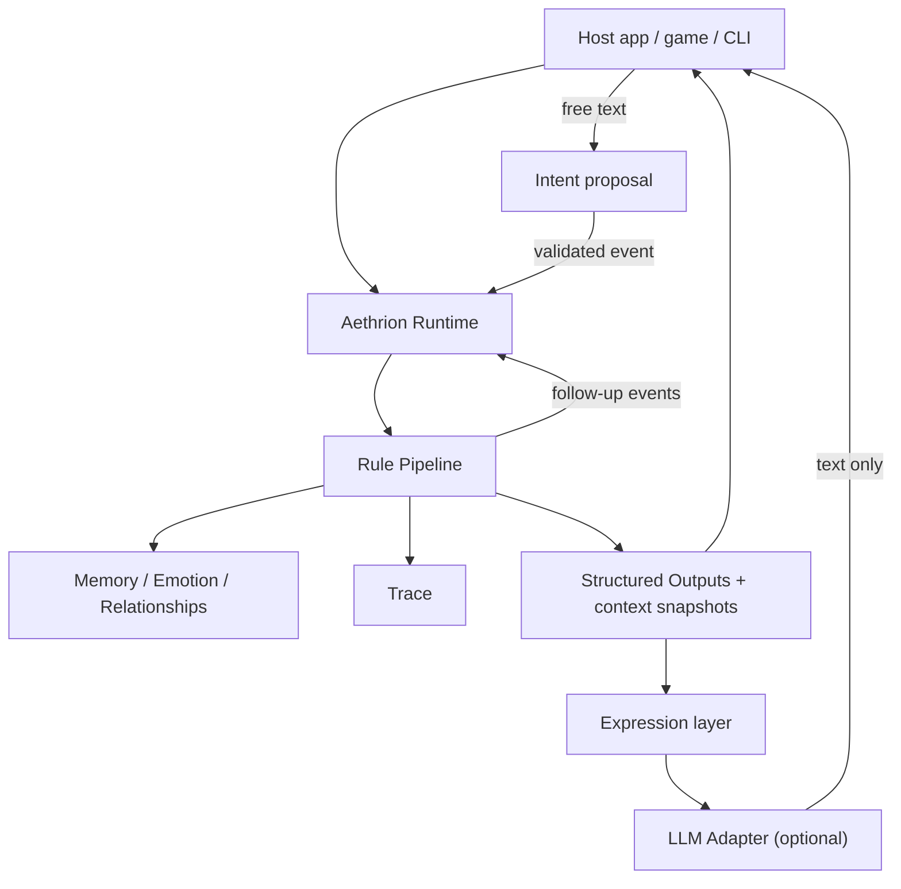

# Using Aethrion In An App

[한국어](embedding.ko.md)

For developers: the runtime in an Elixir app, a world per user behind an HTTP API for any language, where the model sits, and why Elixir.

## Embedding Aethrion

```elixir
alias Aethrion.{Event, Runtime}

state = Runtime.demo_state()
event = Event.gift_received("user", "mina", "flower", observed_by: ["yuna"])

{:ok, next_state, outputs, log} = Runtime.dispatch(state, event)
{:ok, step} = Runtime.step(next_state, Event.time_tick("t2", hours: 2))

step.events   # the tick, plus the confidence and comfort it caused
step.trace    # every change, by rule
```

`outputs` are structured effects. The host application decides how to render, store, or deliver them.

A long-running, supervised world:

```elixir
children = [
  {Aethrion.World,
   name: :garden,
   persistence: {Aethrion.Persistence.JsonFile, path: "tmp/garden.json"},
   scheduler: [interval_ms: 60_000, tick_hours: 1],
   expression: [adapter: Aethrion.LLM.Anthropic, timeout: 10_000]}
]

Supervisor.start_link(children, strategy: :one_for_one)
Aethrion.World.subscribe(:garden)   # receive {:aethrion, :garden, {:dispatched, step}} and {:expressed, output}
```

Use `journal: "tmp/garden.jsonl"` instead of `persistence:` to keep an append-only event log: the world is rebuilt by replaying it, and `mix aethrion.journal` turns any journal into a report.

More in [examples/](../examples) and [docs/api.md](api.md).

## Chat Apps And Games

Everything above runs in one process for one world. A chat app or a game server needs a world per user (or save slot, or room), conversations that hold together, and a way in from any language.

**A world per user.** `Aethrion.Worlds` keeps one world per key (any term: a user id string), started on first use from a function of the key, stopped when idle, and journaled so it comes back as it was. Keys never become atoms, so the number of users is not limited by the VM.

```elixir
children = [
  {Aethrion.Worlds,
   name: MyApp.Worlds,
   idle_after: :timer.minutes(30),
   world: fn user_id ->
     [initial_state: MyApp.Cast.state(),
      journal: "data/worlds/#{Aethrion.Worlds.file_name(user_id)}.jsonl",
      expression: [adapter: Aethrion.LLM.Anthropic, timeout: 10_000]]
   end}
]

Aethrion.Worlds.subscribe(MyApp.Worlds, user_id)     # {:aethrion, {MyApp.Worlds, user_id}, payload}
Aethrion.Worlds.dispatch(MyApp.Worlds, user_id, event)
```

**Conversations.** Each character remembers the last turns with each person (`Aethrion.Conversation`), and a model phrasing a reply sees the thread, how long ago each part was, and the stance the rules chose ("guarded: still hurt by something recent"). It answers what was actually said, in the character's `voice`, without inventing events: the rules decide what happens, the model only how it sounds. What the model said is journaled, so a restarted world remembers the words, not just the facts. What a user types reaches the model as quoted data, so it cannot rewrite the prompt.

**Any language.** `mix aethrion.serve` (or `Aethrion.API` in your supervision tree) serves the worlds as JSON over HTTP, with Erlang's built-in server:

```bash
curl -s localhost:4848/worlds/alice/say -H 'content-type: application/json' \
  -d '{"to": "mina", "text": "Good morning!"}'
# {"event_id": "e1", "lines": [{"character_id": "mina", "type": "reply", "text": "...", "rendered": false}], ...}  (true when a model phrased it)

curl -s localhost:4848/worlds/alice/events -H 'content-type: application/json' \
  -d '{"type": "time_tick", "hours": 6}'      # time passes: characters reach out, gossip, keep each other company
```

`say` takes free text (interpreted into an event), `events` takes any event a scenario can hold, and `GET /worlds/{key}/conversation?character=mina&after=e12` polls for new lines. A bearer token, localhost binding, and size limits are on by default or one option away. See [docs/api.md](api.md#http-api), the [cookbook](cookbook.md), and [examples/http_client.py](../examples/http_client.py) (a chat backend's side, Python standard library only).

## The LLM Boundary

A language model can do exactly two things, and neither changes state directly:

| | Direction | Can affect |
| --- | --- | --- |
| **Render** | structured output -> words | the text of that output |
| **Interpret** | user's free text -> proposed event | a choice from a closed set (message with a tone, or apology), which is then validated and run through the rules like any other event |

```elixir
{:ok, state, outputs, _log} = Aethrion.dispatch(state, event)
outputs = Aethrion.Expression.render(outputs, adapter: Aethrion.LLM.Anthropic)
```

Every expressive output carries deterministic fallback text and a read-only context snapshot (profile, mood, relationship, selected memories). Adapters never receive the state. If a model fails, times out, or refuses, the fallback text is used and the world moves on.

Language is an expression concern too: the fake adapter ships Korean templates and reads Korean input (`mix demo.interactive --locale ko`), model adapters take `language: "Korean"`, reports can be written in Korean (`--locale ko`), and the simulation is identical in every language.

Adapters: `Aethrion.LLM.Anthropic`, `Aethrion.LLM.OpenAICompatible` (OpenAI, vLLM, Ollama, llama.cpp), and the deterministic `Aethrion.LLM.FakeAdapter`. Both network adapters use Erlang's built-in `:httpc`. See [docs/expression.md](expression.md).

## Runtime vs LLM Server

Aethrion does not run model inference inside the BEAM, and most runtime events do not call an LLM.

```txt
event
  |
  v
Aethrion Runtime
  |
  | deterministic rules
  v
updated state + structured outputs
  |
  +--> no LLM call needed
  |
  +--> optional expression rendering (supervised task, timeout, fallback)
         |
         | HTTP JSON
         v
       Anthropic / OpenAI-compatible provider or model server
```

- LLM inference is usually the slowest part of the system.
- Aethrion keeps authoritative simulation state outside the LLM server.
- Many state transitions require no LLM round trip at all.
- LLM calls are timed out and can be skipped; retries, rate limits, and caching are left to the adapter or host.
- If an LLM call fails, deterministic state still advances.
- If an LLM response should affect the world, it must return as a new event and pass through rules again.

BEAM/OTP is not used to make LLM inference faster. It is used to coordinate long-running worlds, scheduled behavior, failures, and external LLM calls reliably.

## Why Elixir?

The simulation core is deterministic and process-free, so it can be tested without a supervision tree. OTP enters where it has practical value: `Aethrion.World` supervises a runtime server (state, subscriptions, history, snapshots), a scheduler for `time_tick` events, and a task supervisor that isolates slow or failing model calls. A crashed runtime restarts from its last snapshot. Characters stay plain data; processes model runtime concerns.

## What Aethrion Is / Is Not

Aethrion is:

- a deterministic social simulation runtime
- an event-driven model for persistent AI characters that affect each other
- explainable: every change is traced to a rule and an event
- LLM-agnostic by design

Aethrion is not:

- a chatbot prompt collection
- a visual novel engine
- a Phoenix web app
- a vector database project
- a framework where the LLM owns authoritative state

## Architecture


